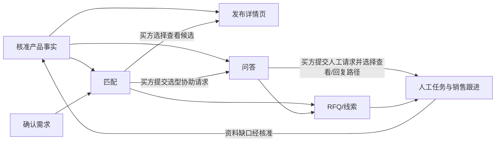

# 跨境工业品 AI 售前平台｜最小 MVP 开发需求文档

**版本**：草案 0.6 · 2026-10-01
**状态**：供产品确认与开发拆解；第 8 节列出正式试点前需要逐步确定的事项，不要求用户现在一次性填写。  
**目标**：用工业水泵证明一条询盘能从自然语言需求进入产品推荐、可信问答、RFQ 或待培育线索，并由销售接手。当前水泵资料和演示不能替代正式授权、企业核准或客户验证。

**主要使用者与界面边界**：本 SaaS 主要服务工业品卖家；企业成员在授权管理后台完成资料核准、页面发布、人工答复、RFQ 和销售处理。买家只接触产品对话、产品详情页和 RFQ 等对外触点，不使用卖家管理后台。后台的布局与交互设计应优先服务卖家长期、反复的工作任务。

**长期产品关系**：本 MVP 聚焦「售前转化层」；获客层的内容生产与主动开发、销售运营层的智能培育与 CRM 集成，记录在 [长期功能代办备忘录](长期功能代办备忘录.md)。这些功能与 MVP 共用核准产品知识、买方需求和销售事件，但不因列入路线图而视为本轮已开发。

**技术实现边界**：产品事实来源、企业数据隔离、版本快照、模块接口与失败回退见 [技术架构草案](技术架构草案.md)。该文是开发前的结构建议，不指定技术栈或要求 MVP 拆分微服务。

**可靠性开发顺序**：自动备份与恢复演练、模型故障的内部处理及买方可请求人工的路径等当前要做的措施，以及双模型、双实例、数据库高可用的启用条件，统一记录在 [架构决策记录](架构决策记录.md)；不要从候选方案直接推断 MVP 全部必须采购。

## 1. 边界与成功定义

### 1.1 用户与入口

| 角色 | 在 MVP 中完成的事 |
| --- | --- |
| 企业管理员/产品负责人 | 导入资料、核对技术字段、发布产品页；管理员分配新 RFQ |
| 买方 | 描述需求、补充工况、查看推荐页、提问、提交 RFQ 或留下待跟进需求 |
| 销售 | 从共享队列领取 RFQ、查看线索完整上下文、记录下一步与跟进日期 |
| 售前工程师 | 回答系统不能确认的技术问题，指出资料缺口 |

演示入口采用网页对话，也允许从公开产品页直接开始。已知型号的买方可直接查看资料、提问或发起 RFQ，不必先完成需求匹配；需要帮忙选型时进入需求识别。其他渠道暂通过手动填写来源标签进入统一记录；真正的平台消息收发、自动邮件和 CRM 同步不在 MVP 内。后台默认中文，买方界面默认英文；两侧均保留中英切换按钮。技术事实及引用保持原文可查，翻译内容不得改变参数和单位。

网页直接访客浏览公开产品页、进行常规资料问答时，不强制注册或提供联系方式。请求工程师答复时可选择只在原网页会话查看；仅当同一浏览器保存的会话访问凭据仍有效时，才可返回原会话，且没有站外提醒。清除站点数据或换设备后不承诺匿名买方自动找回原会话；卖方后台已保存的记录不因此删除。买方在任意阶段都能主动发起 RFQ；明确询问其采购所需的价格、交期或样品时，可额外提示这一入口，但系统不据此决定买方是否有权询价。只有买方提交 RFQ 时才强制确认可回复联系方式。单纯浏览、下载 CAD、停留较久或询问个案适用性，不单独触发留资要求。

### 1.2 可验收的端到端场景

1. 管理员导入至少 **2 个有不同适用条件的示例水泵型号**，修正并核准关键字段，发布带有初步seo和geo的各自详情页。仅有一个型号不足以验证“从产品库匹配”的功能。
2. 需要选型的买家进入询盘页面，描述用途、流量和扬程。系统每次只追问当前最影响匹配结论的一项缺失条件；其余缺项显示在可编辑参数卡，买方可修改数值、单位或标记“不确定”。展示任何基于匹配产生的型号候选前，买方须确认摘要中的已知条件和未知标记；无需为了继续而编造数值。已知型号的买方也可从公开详情页直接进入资料问答或 RFQ，无须先确认选型摘要。
3. 条件足够时，系统并列展示有依据的初步候选、差异、未确认条件及各自固定详情页；没有经核准的排序依据时不宣称“最优”。缺少关键条件时，买方明确选择“请求工程师协助选型”或“查看待核实候选”；后者只显示待核实的候选及缺项，不宣称适用。已知硬冲突或没有可靠候选时不输出适用结论。
4. 买方问一个资料内问题：显示答案及来源。再问一个资料外或需工程判断的问题：结合其问题说明还需要核实什么，提供“请求工程师答复”入口。买方主动提交人工请求后，后台生成带上下文的任务；网页买方可选择只在原对话查看回复，无须填写邮箱或电话。未请求时保留问题记录，不冒充已经安排人工处理。工程师从工作台答复后，买方原网页对话显示该条人工回复。
5. 买方提交结构化 RFQ，或保留尚在调研的线索，（若对话在买家侧中断且持续无后续回复则标记为正在调研）。销售能在工作台查看每个客户对话涉及的产品、工况、问答、缺项、来源、负责人、阶段和下一步等销售线索。
6. 网页买方从对话进入详情页、RFQ 并返回时，仍能接续同一会话、已填工况、问题和原 RFQ；同一浏览器且会话访问凭据有效时，返回或刷新后可查看人工回复状态。清除站点数据或换设备后不自动找回匿名会话，也不因买方输入同一邮箱就关联旧会话。企业成员重新登录后仍能读取已保存的产品、RFQ、线索和处理状态。演示不依赖固定脚本顺序才能走通。

**成功不等于**订单成交或效率提升。MVP 只验证流程是否准确、可理解、可追踪；商业效果需要试点测量。

## 2. 按用户旅程拆分的模块

| 模块 | 主要界面 | 关键功能 | 核心输出 |
| --- | --- | --- | --- |
| M1 产品资料导入与核准 | 企业后台：产品列表、导入向导、字段核对页 | 上传/分类 PDF、表格、图片和 CAD；抽取字段；显示原文件位置；人工修正、核准与禁用字段 | 已核准的产品事实、来源与版本 |
| M2 产品详情页 | 企业后台：页面编辑/预览；买方：产品页 | 选择展示维度；参数、曲线、应用示意、2D/3D 与原文件入口；发布固定链接 | 可分享的产品页版本 |
| M3 对话与需求识别 | 买方：聊天及需求摘要卡 | 记录原话与来源；抽取品类、用途、工况；区分已确认/推测/缺失；有限追问与确认 | 结构化需求 |
| M4 匹配与推荐 | 买方：推荐卡；后台：匹配依据 | 用核准字段筛选候选；展示满足项、冲突项、未确认项；发送理由和详情页 | 推荐结果或不可推荐原因 |
| M5 资料问答与人工接管 | 买方：问答；后台：待处理任务 | 只用核准资料回答并给出处；需人工判断时说明原因并邀请买方主动请求；保留上下文及回复 | 有来源的答案或买方请求的人工任务 |
| M6 RFQ 与待培育线索 | 买方：询价表单/暂存入口 | 预填已确认工况；收集数量、地区、期望交期、联系方式；保存 RFQ 或待培育状态 | 可处理的询价/线索 |
| M7 销售工作台 | 企业后台：线索列表与详情 | 查看全链路记录；负责人、阶段、下一步、跟进日期和备注；处理人工任务 | 持续跟进记录 |

## 3. 模块功能与验收标准

### M1 产品资料导入与核准

**功能**：上传资料并自动关联型号；优先抽取、人工编辑水泵关键字段（流量范围、扬程范围、介质适用条件及资料来源），缺失字段标明待补充，不作为详情页发布的硬性门槛；保留原值、修正值、来源文件与位置、核准人和核准时间；发布/撤回核准状态。CAD 可作为附件与预览素材，不要求自动从 CAD 精确抽取工程参数。

**验收**：

- 上传后能看见文件归属的产品、类型与处理状态；抽取失败可手工录入，不会被默认为已核准。
- 管理员可从任一对外参数回到对应文件及位置；缺失、冲突或未核准字段有明显标记。
- 未核准字段不得成为匹配依据、公开参数或 Agent 的确定性答案。修改已发布关键字段后需重新核准并生成可识别版本。
- 管理员或获得相应授权的成员可核准已掌握的字段和页面内容；即使其他字段、曲线或 CAD 尚缺，仍可在核对后发布有限信息页面。缺项在后台可见，不能被填写为推测值。

### M2 产品详情页

**功能**：使用平台预设的水泵产品页工作流与提示词生成固定页面草稿；管理员或获授权成员逐项核对拟展示的数据与说法，预览并确认后发布，不在 MVP 中编辑工作流或提示词。买方查看型号，以及已有且已核准的用途、关键参数、曲线、材质、应用示意、可用可互动的 2D/3D 展示和对应的资料下载；缺失项明确提示，显示版本/来源及“初步展示，正式选型需确认”的边界。后续补齐资料须重新核准并发布新页面版本。

**验收**：

- 推荐链接和直接分享的产品链接均打开对应型号与已发布版本；未发布页不能被买方公开访问。直接访问者可进入提问或 RFQ，无须先走选型对话。
- 页面技术字段与当前已发布的核准资料一致；缺少曲线、CAD、3D 或部分参数不阻止授权成员发布，但缺失的资料须如实标明，不显示虚假占位能力或推测参数。
- 移动端和桌面端均兼容并可读，已有的核准参数、缺项提示与继续提问/询价入口可找到；可下载资料指向正确文件。
- 同一产品的产品详情页面内容除非用户重新发布同一型号产品覆盖当前页面否者 同一产品的产品详情页面可复用，本次客户的工况说明单独呈现，不写回产品通用事实。
- 页面生成须先进入人工核对与买方视角预览，确认公开内容和缺项后由有发布权限的成员操作，不能仅凭提示词直接公开技术结论；后续补充形成新核准事实和新页面版本，旧版历史可追查。初步 SEO/GEO 仅指该产品页的清晰标题、结构化信息、可读技术说明与可分享链接，不包含成批生成搜索落地页或保证搜索/AI 推荐结果。
- MVP 用预设模板验证产品页主流程；卖家自行编辑品类工作流、提示词及企业模板库属于 V1，不作为当前页面发布的前置条件。
- 对已有且获准使用的 STEP/DXF 等文件，提供与型号关联的预览或下载；若浏览器无法直接显示某格式，应提供经核对的可视化衍生文件或原文件下载。不得把示意模型标为原厂工程 CAD。

### M3 对话与需求识别

**功能**：保存买方原话；识别水泵需求字段并显示结构化摘要；每轮只追问当前最影响匹配的一项缺失条件，其他缺项留在可编辑参数卡；允许买方直接修改已提取的数值、单位或标记“不确定”；记录来源渠道和买家角色（角色可留空、可由销售修正）。

**验收**：

- 系统不会把推测值写成买方已确认值；每个用于匹配的条件可追溯到买方输入或确认动作。
- 缺少影响推荐的条件时逐项追问当前最关键的一项，并说明用途；其他缺项可直接在参数卡修改或选“不确定”。买方拒答后不反复追问同一项，仍可请求人工帮助或保存线索。
- 买方在对话或参数卡中修改同一条件后，摘要显示修改后的值和确认状态；标记“不确定”的条件不当成已满足，已知条件不重复追问。
- 展示任何由需求匹配产生的候选前，买方须在参数卡确认已知值和未知标记；确认未知不等于确认产品适用。已知型号的公开产品页直接访问不受此门槛限制。
- 需求摘要变化后，已有推荐失效并重新计算；历史原话保留。

### M4 匹配与推荐

**功能**：MVP 用可查看的品类规则与核准字段做初步筛选；买方确认需求摘要后才展示匹配产生的型号候选。产品页已发布不等于型号具备匹配依据：核准信息足以支持规则判断时可进入初步候选；缺关键条件但已有核准事实支持相关性、且没有已知硬冲突时，仅可在买方选择查看后进入待核实候选；只有名称、图片等而没有支持相关性的技术依据时，不进入匹配候选，仍可直接浏览公开页。候选可为多款，并列比较差异、已满足条件和未知项；结果分为“可初步推荐”“条件不足”“无可靠候选”。条件不足时由买方选择请求工程师协助选型，或查看明确标为“待核实候选”的探索列表。

**验收**：

- 相同产品数据和已确认工况产生可重复的结果；销售可查看使用的字段与规则。
- 关键条件冲突时不输出“适用”；条件不足时不将未知视为满足。
- 用三种已发布产品页验收：核准信息满足规则的型号可初步推荐；有核准相关性依据但缺关键条件的型号只能在买方主动选择后作为逐款标缺项的待核实候选；无相关性技术依据的型号不进入匹配结果，只能直接访问页面。已知硬冲突的型号不进入这两类候选。
- 未确认需求摘要前不展示任何由匹配产生的型号候选，包括待核实候选；直接打开已知型号的公开详情页不属于匹配候选。
- 条件不足时同时给出“请求工程师协助选型”和“查看待核实候选”选择；待核实候选逐款显示未确认条件，不写成“适用”“精准推荐”或“最优”。请求工程师只有买方按 M5 提交后才生成任务。已知硬冲突的型号不得进入适用候选；无可靠候选时解释原因并提供人工入口。
- 多个候选并列展示型号、关键差异、已满足条件、理由、未确认项及各自正确的详情页链接；没有经核准的比较或排序依据时不标“最佳”。
- 规则和阈值须由相应产品负责人或工程师核准；演示规则不能被标成正式选型方法。

### M5 资料问答与人工接管

**功能**：按当前型号检索已核准资料；回答时给文件、页码/位置、版本。资料不足、相互冲突或需个案判断时，先结合买方问题说明还需核实的内容，再提供“请求工程师答复”操作；买方主动提交请求后，创建带上下文的人工任务。等待期间买方仍可浏览及向 Agent 提其他问题。工程师可在同一任务和原会话中追问必要工况，买方补充后继续处理；最终答复发布到原网页对话，或通过已有联系方式人工回复并记录处理结果。买方未请求时保留未解问题，不创建需对外回复的任务。MVP 不建设向邮箱或其他渠道自动发送同一答复的能力。

**买方操作**：点击“请求工程师答复”后，选择“在此对话查看回复”（网页买方的默认选项），或自愿提供/确认已有联系方式供销售人工回复；当前 MVP 不自动向外部渠道发送。若只选网页对话，提交前明确告知：买方需返回原会话查看，系统不会向邮箱或社交渠道主动通知。买方可取消并继续浏览，无须注册账号。只有买方提交成功后才创建人工任务并显示收到请求；仅点击入口不算已安排人工。提交 RFQ 仍须按 M6 确认联系方式。

**验收**：

- 已知测试问题的答案与引用原文相符；引用能打开到正确资料位置或清楚指向对应文件。
- 对资料不存在、冲突或无法判断的问题不编造参数、认证、价格或交期。
- 需人工判断时，买方能看出系统已理解的具体问题、目前能确认的事实、还需工程师核实的原因和下一步选择；不使用统一的“无法确认”作为全部回复，也不暗示工程师已处理或承诺未核准的回复时间。
- 买方未选择人工帮助，或打开请求步骤后取消时，不生成需对外回复的人工任务；原对话保留，可继续浏览或提问。选择只在原网页对话查看时，不要求注册或填写邮箱/电话；提交成功后才显示已收到请求，重复点击不产生重复任务。买方仅在同一浏览器且会话访问凭据仍有效时返回原会话查看任务状态与答复；未留联系方式时不显示会收到站外提醒或允许跨设备找回的承诺。
- 人工任务等待期间不锁住买方会话：买方可继续浏览、向 Agent 提新问题；原人工请求的当前状态仍可辨认，新问题不自动重复创建同一人工任务。
- 任务包含原问题、买方已确认工况、推荐型号、已回答内容及缺失原因；销售/工程师可看见处理状态。
- 工程师需要补充工况时，在原会话发布针对该任务的追问；状态转为“待买方补充”。买方回复后原任务继续处理，不为同一追问新建任务；双方刷新后仍能看到追问、回复与当前等待方。
- 工程师的专业判断和答复内容由工程师本人决定；系统负责传递、记录和区分人工身份，不另设“工程师无法得出结论”的强制话术或判断流程。
- 工程师从工作台发布答复后，买方原网页对话出现该条答复并标明人工身份；刷新后双方仍可查看记录。通过已有联系方式人工回复时，销售在工作台记录使用的方式、处理人、时间与结果，不将“已写好草稿”当作“买方已收到”。MVP 不以邮箱或社交平台自动投递成功作为验收条件。
- 人工答复不会自动变成产品通用知识，须走 M1 核准。

**话术设计方向（具体文案待试点验证）**：使用买方刚提供的场景或条件，简短说明核实点，再邀请其选择人工答复；界面明确表明这是产品内 AI 助手，不让文案冒充真人。能从核准资料确认的内容继续给出处；不能确认的适用性结论保持待核实。收集联系方式时说明用途是送达本次问题的回复，避免在普通资料问答前索取。

### M6 RFQ 与待培育线索

**功能**：买方在对话或产品页的任意阶段可发起 RFQ，不以完成选型、工况完整或系统识别出购买信号为前置条件。从对话和推荐预填已有的已确认工况、型号及待确认项；直接从产品页发起时保留买方指定型号，将未经过匹配的适用性条件标为待确认；补充数量、目的地、期望交期、联系方式及自由说明；买方确认现有摘要后提交。提交后买方仍可打开原 RFQ，查看当前内容，增加、移除或修改其中的字段与说明；本阶段不提供买方撤回整份 RFQ 的按钮。RFQ 是询价请求，不等于下单或已具备报价条件。买方明确询问其采购的价格、交期或样品时可额外提示 RFQ 入口，不因浏览或普通技术提问要求留资。尚未准备询价时可在获得联系信息及相应同意后保存待培育线索。

**验收**：

- 预填值与已确认需求一致，买方可改；修改关键工况后重新评估推荐。
- 从初次对话或直接访问产品页等任意阶段都可找到 RFQ 入口并提交；询问具体采购价格、交期或样品时可额外提示，买方仍可继续提问而不提交。只有进入 RFQ 提交步骤才执行下述联系信息必填校验。
- 工况、推荐、数量等技术或商务资料不完整时仍允许提交，缺项显示“待补充”，不误标“可报价”；报价前所需清单由水泵试点企业确认，不作为买方提交 RFQ 的门槛。
- 提交 RFQ 前必须提供并确认至少一种销售能实际回复的联系方式；已有且可用的联系信息可预填供买方确认或修改，不要求重复输入。具体可接受的渠道与校验方式在试点报价流程中确定。
- 提交后生成唯一记录；重复点击不产生重复 RFQ；后台能检索并打开。
- 原买方重新打开 RFQ 后可增补、移除或修改字段并保存，看到的是该 RFQ 当前内容，无须阅读历次变更；保存后仍使用原 RFQ 编号，不生成新的询价。初次提交和每次后续变更保留可追溯记录，仅在卖方工作台展示。
- 买方详情中不出现“撤回整份 RFQ”操作；销售可在工作台按实际沟通更新线索阶段，不能仅凭 RFQ 仍存在就判定买方当前仍打算采购。
- 联系信息只在授权的企业后台可见；买方可看见提交结果与下一步说明。

### M7 销售工作台

**功能**：新 RFQ 进入企业共享待处理队列；销售可领取，管理员可分配给销售。买方修改 RFQ 后，在原线索上向卖方显示变更提醒和历次变更，不另建线索。买方在产品对话中明确要求不要再主动联系，或销售记录买方在已有联系渠道提出的同一要求时，原线索标记“停止主动联系”，保留 RFQ 与历史，不再安排主动跟进；买方再次主动发起沟通时可恢复处理。线索列表、详情、来源、当前阶段、负责人、跟进日期、待处理技术问题和操作记录；销售可修改阶段、记录备注、安排下一步；工程师可回复被分配的问题。

**验收**：

- 从任一 RFQ 或线索可查看完整需求、推荐、页面版本、问答与人工任务，无须跨系统拼接。
- 新 RFQ 即使工况不完整也出现在本企业共享待处理队列；销售领取或管理员分配后可见负责人。未分配记录仍留在队列；领取、分配与改派保留操作者和时间。
- 买方修改 RFQ 后，销售能在原线索上看到有新变更，并查看初次提交内容、每次修改的字段、修改前后内容和时间；买方界面只展示当前内容。
- 买方在产品内明确要求停止主动联系，或销售记录其在已有渠道的同一要求后，工作台显示该标记和原话/时间，暂停主动跟进待办；卖方仍可查看 RFQ 历史。买方后来主动联系时可回应其新请求，并记录停止标记的变化。MVP 的站外人工联系无法由软件代为拦截，工作台须明确提示销售遵守此状态。
- 新线索在列表中可识别；保存负责人、阶段和日期后刷新不丢失；逾期任务有可见标记。
- 后台用户只能访问所属企业的数据；关键变更至少记录操作者与时间。

## 4. 模块联动与状态规则

**单一事实来源**：页面、匹配和问答都引用同一份核准产品版本。**会话快照**：RFQ 保存初次提交时的产品版本、需求与推荐结果；买方后续修改形成新修订，卖方可追查原始内容，产品更新也不应悄悄改写历史询价。**状态划分**：产品草稿/待核准/已发布/已撤回；需求待确认/已确认；推荐可初步推荐/条件不足/无可靠候选；人工任务待处理/处理中/已答复；线索待跟进/技术确认中/待买方补充/可报价/暂缓。买方“停止主动联系”单独记录，不用 RFQ 是否存在或采购阶段代替。状态名可在试点中调整，状态间必须保留操作者与时间。

## 5. 前端 UI 与功能关联

**产品内完成业务操作（用户已确认，2026-09-30）**：本阶段承诺的功能必须通过正式产品界面及其后台流程完成。企业成员和买方通过按钮、表单、导航、产品内对话及明确的状态反馈操作；模块之间的数据由程序按已保存对象自动传递。这里的产品内 Agent 是软件功能，不是当前开发助手。开发阶段与助手的对话不作为产品运行依赖。

验收时，由测试者仅使用产品界面走通“上传、核准、发布 → 买方需求确认 → 推荐与产品页 → 有据问答或人工任务 → RFQ → 销售处理”。买方在对话页、详情页和 RFQ 页之间往返时，不重建会话、不丢失已填工况，能找到原问题、人工回复状态及可继续编辑的原 RFQ；同一浏览器且会话访问凭据有效时，刷新或返回后仍可接续。清除站点数据或换设备后，匿名买方不应仅凭公开产品链接、会话 ID 或输入相同邮箱读取旧会话；卖方后台原记录仍在。不能要求测试者在开发聊天里发指令、运行脚本或让开发助手手动搬数据才能完成这些业务步骤。后台自动作业可以由用户操作或业务事件触发，进度、结果和失败处理应在产品界面可见；人工接管由工程师在工作台处理。仅有界面原型或模拟数据时须明确标注，不能据此宣称功能已通过完整产品验收。

| 页面/区域 | 信息层级与交互 | 对应模块 |
| --- | --- | --- |
| 企业产品列表 | 型号、核准状态、资料版本、页面发布状态、资料缺口；进入导入/编辑 | M1、M2 |
| 导入与核对页 | 左侧原文件预览，右侧提取字段与来源；差异、缺失、逐项核准动作明显，资料不足仍可继续准备有限信息页 | M1 |
| 产品页编辑/预览 | 后台选择展示区块；买方视角预览已核准内容及缺项；授权发布、补齐后重发的版本及链接 | M2 |
| 买方对话页 | 对话每次只问最关键缺项，其他条件留在可编辑参数卡；买方确认已知值和未知标记后才可查看匹配候选。条件不足时选择工程师协助或待核实候选；多款候选并列比较差异、依据、限制和详情页 CTA；任意阶段可发起 RFQ；跨页返回后保留原会话及工况；提供中英切换 | M3、M4、M5、M6 |
| 买方产品详情页 | 型号、已核准用途、可用参数与资料、缺项及来源可找到；有当前会话推荐时单独显示本次推荐理由。直接访问者可查看、提问或发起 RFQ，并可选择“帮我选型”；从对话进入时能继续原会话，不丢问题与人工答复状态。首屏与区块顺序待详情页调研，不在本轮固定 | M2、M3、M5、M6 |
| RFQ 表单与买方详情 | 已知字段从同一会话预填并标来源；未知条件单独列出但不阻止提交；提交前摘要与必需联系方式确认；直接指定型号但未经过选型的场景标明适用性待确认。提交后买方可找到并编辑原 RFQ，只看当前内容；返回对话或详情页不丢状态 | M6 |
| 销售工作台 | 企业共享新 RFQ 队列支持销售领取与管理员分配；原线索提示买方的新修改，卖方可看初次提交和逐次变更；“停止主动联系”醒目显示并暂停主动跟进待办；列表按待处理与跟进日期排序；详情将需求、推荐、问答、RFQ 和时间线放在同一视图；工程师可发布回复到原网页对话，销售可记录通过已有联系方式人工回复的结果 | M5、M6、M7 |

视觉风格、品牌色、字体和具体组件样式待用户确认。无论采用何种风格，界面都应清楚区分**产品事实、AI 提取、买方确认和人工判断**；技术引用、错误与待确认项不得仅靠颜色表达。语言切换不清空已填工况、RFQ 或对话；切换后的页面标签、表单提示和状态文案应一致，原始资料引用可保持原语言并标明。

## 6. 数据、权限、质量与测量

- **基本对象**：企业、后台用户、产品/型号、来源文件、核准字段、页面版本、会话、需求、推荐、答案/引用、人工任务、RFQ、线索、跟进记录。可按实现需要合并表，但不能混淆产品事实与买方数据。
- **权限**：买方只访问公开页及自己的会话结果；企业成员仅看所属企业数据；企业用户权限分类，管理员账户可以控制同组织内其他账号对各个功能的访问权限，例如：发布和核准由授权角色操作。MVP 至少具备登录、租户隔离和操作记录。
- **数据保护**：上传文件、联系方式、会话和 RFQ 不得出现在其他企业的公开页面或响应中；演示使用模拟个人信息。正式试点的数据保留、删除、跨境处理规则需单独确认。
- **基本事件**：入口来源、需求摘要确认、初步推荐/待核实候选展示或拒绝推荐、详情页打开、问答有据/买方请求人工、人工答复发布/查看、RFQ 提交与后续修订、线索分配和跟进完成。事件用于发现流程问题，不把 Demo 行为称作转化率提升。
- **验收证据**：每个端到端场景应保存输入、页面截图/录屏、匹配依据、引用来源和后台记录；同时测试缺字段、冲突、无候选、重复提交与跨企业访问。

## 7. 明确不在 MVP 内

WhatsApp/微信/Telegram 正式接入；自动搜寻潜客和冷邮件；
**自动营销序列**（按预设时间与条件连续向潜客发送多封营销/培育消息；MVP 仍记录销售下一步和跟进日期）；
**SEO 内容批量生成与发布**（MVP 可以把已核准资料用于单个产品页和 FAQ，不建设关键词研究、成批页面生产与 SEO 成效管理流程）；
**卖家自行编辑完整品类工作流、提示词与企业模板库**（MVP 使用预设水泵模板并保留产品页预览和核准；完整编辑器进入 V1）；
实时价格库存；自动报价/下单/付款；
**复杂 CRM 双向同步**（MVP 内保存线索与跟进记录，允许后续增加导出；暂不让本平台与外部 CRM 互相自动更新客户、商机和阶段）；
**从不完整资料自动生成工程 CAD 模型**（已有且允许使用的 STEP/DXF 文件预览、交互展示及下载属于 M2）；
合同法律结论；对所有工业品的通用选型器。

上述暂缓项是后续产品机会，不是被否定的价值。它们的用途、所属模块、前置条件与进入开发的验证条件见 [长期功能代办备忘录](长期功能代办备忘录.md)。

### 7.1 MVP 为后续功能保留的连接点

| 后续方向 | MVP 已需保留的结构 | 本轮不做的部分 |
| --- | --- | --- |
| 产品知识驱动的 SEO/应用内容（F-01/02） | 核准技术事实、产品页版本、可分享链接与入口来源；单页初步 SEO/GEO | 批量选题、生成、发布和流量归因平台 |
| 有上下文的跟进（F-04/05） | 买方确认工况、页面/资料互动、问题、RFQ、负责人及下一步事件 | 自动判定采购阶段及未经审核的连续对外发送 |
| CRM 对接（F-06/07） | 稳定的线索/RFQ ID、阶段、负责人、记录时间和可导出的字段 | 特定 CRM 的字段映射、授权、冲突处理与双向同步 |
| CAD 深度交互（F-08/09） | 已有模型与产品型号/资料版本关联、可预览或下载 | 部件级语义映射与点击部件问答 |
| 新 CAD 生成（F-10/11） | 明确原厂文件、审核状态与示意素材的来源区别 | 参数化工程模型或 AI 推测模型自动生成 |

这张表是数据与验收边界，不要求为未来功能提前搭建通用框架。后续是否进入开发，应根据试点需求和 [长期功能代办备忘录](长期功能代办备忘录.md) 的条件决定。

## 8. 以后需要确定的事项（现在不用逐项填写）

（此部分不是要求现在修改文档的问卷。它们是提醒开发团队：**哪些具体规则不能由 AI 或程序员替企业拍板**。当前先按表中“暂时怎么做”推进；到了设计视觉、接入真实工厂或对外发布的相应阶段，再由合适的人确认。你也可以随时直接在文档里批注或在聊天中告诉我决定，我会同步更新。）

| 说白了要决定什么 | 谁来决定、什么时候决定 | 暂时怎么做 |
| --- | --- | --- |
| 英文产品说明由谁检查？例如材料、单位或适用条件的英文有没有翻译错。 | 找到试点工厂后，由其懂产品的负责人或工程师在对外发布前检查；现在不需要你承担技术审核。 | 页面可做中英切换；未经核准的英文技术说法只作演示，不标为正式资料。 |
| 页面要长什么样？例如品牌色、字体、图片风格。 | 你在开始高保真 UI 设计前决定或提供参考；目前你已决定先定布局和交互、风格暂缓。 | 先设计信息排列、按钮和操作路径，不擅自确定品牌视觉。 |
| 推荐水泵前必须问哪些使用条件？什么数值算符合或不符合？“工况”就是介质、流量、扬程、供电等实际使用条件；“匹配阈值”就是选型判断规则。 | 真正试点时由工厂工程师确认；不能由产品经理或 AI 凭空设定正式选型规则。 | Demo 可以展示清楚标注的示例规则；缺少关键条件时追问或转人工，不宣称正式适配。 |
| 买方提供哪些信息后，工厂才足以开始报价？RFQ 就是买方发给工厂的询价请求。 | 试点工厂的销售与售前人员在接入真实报价流程前确认。 | 先收集产品、工况、数量、交付地区、期望时间和联系人等候选信息；不足时标“待补充”。 |
| 买方请求工程师答复后，后台通知谁、多久处理？“响应目标”是企业承诺的处理时间。 | 试点工厂确定负责人、工作时间和内部通知方式后确认；MVP 演示不做回复时限承诺。 | 买方提交人工请求后在后台生成带上下文的待办任务；工程师从工作台回复到原网页对话。 |
| 用哪家企业的真实产品做试点？资料是否允许放到页面上给买方看？ | 找到试点工厂并取得资料使用与展示许可后确认。 | 当前水泵只作为本地概念 Demo，不暗示厂商授权或合作。 |

## 9. 开发切片建议

先打通 M1 核准数据与 M2 页面，再做 M3/M4 的需求和匹配，接着完成 M5 问答/移交，最后做 M6/M7 保存及后台闭环。每一切片都要使用同一产品版本和会话 ID 验证数据传递；不要等全部 UI 完成后才串联。
