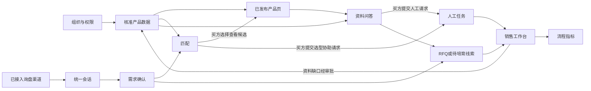

# 跨境工业品 AI 售前平台｜第一版完整功能开发需求文档

**版本**：草案 0.6 · 2026-10-01
**状态**：产品设计稿；待确认项不得由开发团队自行解释为确定需求。  
**产品边界（用户已确认）**：从询盘进入开始，覆盖需求识别、推荐、产品页、问答、RFQ、人工协同和持续跟进。主动寻找潜客、营销邮件群发、SEO 生产及自动 Outbound 不属于第一版。  
**语言（用户已确认）**：企业后台默认中文，买方界面默认英文；提供中英切换。  
**视觉（用户已确认）**：先确定布局、信息层级与交互验收，视觉风格待定。

**长期方向**：获客层（SEO 内容、主动开发）→ 售前转化层（需求、产品知识、匹配、详情页、CAD、RFQ）→ 销售运营层（跟进、CRM、培育）。第一版实现中间层及必要的入口、协作与记录；跨层扩展见 [长期功能代办备忘录](长期功能代办备忘录.md)。这是产品路线设想，不是已验证的商业效果。

**技术结构**：模块责任、数据契约、版本及外部集成边界见 [技术架构草案](技术架构草案.md)；它与本文件的功能验收配合使用，具体实现技术待开发前评审。

**冗余与部署复审**：国内公开测试和海外版本开始前，按 [架构决策记录](架构决策记录.md) 的触发条件复审模型备用、数据库高可用、双应用实例与地域部署，不沿用小范围试点的配置假设。

## 1. 与最小 MVP 的关系

本文件描述**第一版可供设计合作企业实际试用的完整售前工作流**，在 [MVP 开发需求文档](MVP-开发需求文档.md) 的可信产品数据、买方对话、匹配、问答、RFQ 和销售接手上增加：产品版本与审批、多入口询盘归一、多角色协作、可配置的跟进流程、可审计的人工接管、基础分析与数据导出。新增能力不能削弱 MVP 的保守推荐和资料溯源要求。

第一版仍不承诺：自动形成工程选型结论、自动报价/合同决定、替代客户现有 ERP/CRM、保证获客或成交。正式外部渠道接入清单和实施顺序待用户确认。七轮买方旅程评审同时覆盖 MVP 主链路和本版对应增量；外部渠道、协作与分析等本版独有旅程仍需单独评审，不因主链路已讨论就视为完成。

第一版的 Sales Workspace 保持工业品售前协作定位：保存技术需求、推荐证据、人工任务和 RFQ；不预设企业必须把既有 CRM 全部迁入本平台。后续可先做受控导出/单向写入，再按试点需求评估双向同步。

## 2. 用户旅程与跨模块状态

| 阶段 | 主角色 | 用户要完成的事 | 平台核心状态/交接 |
| --- | --- | --- | --- |
| A 企业开通与配置 | 企业管理员 | 建团队、分配权限、配置产品品类与线索阶段 | 企业空间可用，成员权限生效 |
| B 产品资料准备 | 产品负责人/工程师 | 导入资料、抽取、校正、审批和发布页面 | 可用的产品版本与页面版本 |
| C 询盘进入 | 买方/销售 | 从网站或已接入渠道发起咨询，记录来源与身份线索 | 统一会话与线索 |
| D 需求澄清 | 买方/Agent | 描述用途与工况，逐项补充决定性缺项，确认已知值和未知标记；外部渠道在原渠道确认或更正简短摘要 | 已确认需求及未知项 |
| E 推荐与查看 | 买方/Agent | 确认摘要后查看有依据的候选；条件不足时选择工程师协助或待核实候选；选择查看候选时从原渠道收到对应产品页链接 | 推荐/待核实候选快照或人工请求 |
| F 技术问答 | 买方/Agent/工程师 | 获取有出处的答复；复杂问题人工处理 | 答案/引用或人工任务 |
| G 询价或待培育 | 买方/销售 | 提交 RFQ；若尚在调研，保留合适下一步 | RFQ 或待培育线索 |
| H 销售推进 | 销售/主管 | 分配、回复、安排技术确认或样品、记录后续 | 阶段、任务和操作历史 |
| I 复盘改进 | 产品负责人/主管 | 发现高频问题、资料缺口、跟进延迟 | 资料修订与流程改进提案 |

## 3. 模块清单、核心功能与验收

### V1-01 企业空间、权限与配置

**核心功能**：企业空间隔离；成员邀请/停用；管理员、产品负责人、销售、售前工程师等角色；产品核准、页面发布、线索查看、任务回复等权限；配置线索阶段、基础 RFQ 字段和通知接收人。销售分配可手动完成；自动分配仅在试点规则明确后实现。

**验收标准**：

- 不同企业的数据、文件、会话和买方联系信息互不可见；未登录者不能进入后台。
- 无核准权限的成员不能发布技术事实；停用成员不能再登录，但历史记录保留操作者标识。
- 配置修改仅影响后续流程或明确受影响对象；已有 RFQ 与历史产品版本不被无提示重写。
- 管理员能查看关键操作记录（时间、操作者、对象、动作）。

### V1-02 产品资料、核准与版本

**核心功能**：批量或逐项上传 PDF、表格、图片、2D/CAD；按产品/型号归档；模型提出产品品类候选，由授权成员最终核准品类，再调用对应工作流与提示词；字段抽取与人工校正；资料片段引用；识别缺项与矛盾；审批发布；修订、撤回与版本对比；区分可公开、仅内部和禁止使用的附件。

**验收标准**：

- 每条用于匹配、页面或问答的技术事实能追溯文件、位置、版本、核准人和时间。
- 抽取不确定或文件冲突时进入待核对队列，不能自动发布。
- 模型初判品类不等于已核准品类；未由真人核准前不自动套用该品类的对外页面工作流。
- 授权成员核对现有事实、来源和缺项后可批准有限信息页面；缺少曲线、CAD 或部分参数不自动阻止发布，未核准或冲突的内容仍不得对外成为确定性事实。
- 修订已发布事实需生成新版本并经过审批；旧 RFQ 仍引用当时版本。
- 被撤回或限制公开的资料不再出现在新买方页面与 Agent 新回答中；已有引用的处理方式可被管理员审计。
- 产品页、匹配和问答读同一已发布事实版本；不允许三套互相矛盾的人工副本长期并存。

### V1-03 产品详情页与可视化

**核心功能**：按产品管理固定页面；平台提供品类基础模板，卖家可在企业模板库中自行编辑该品类工作流、提示词、提取与展示字段及页面区块，保存草稿并预览，经授权成员核准后发布为新模板版本。页面引用已发布模板和已核准产品事实，配置核心参数、性能资料、材质、尺寸、应用示意、2D/3D 预览及下载；中英内容审核；链接发布/撤回；移动端阅读；从推荐卡带入本次需求说明。页面不因每次对话重新生成整套产品图。

**验收标准**：

- 页面公开内容与已核准产品版本一致，型号和版本醒目；有限信息页面如实提示缺项，无资料的能力不虚构。补齐资料后须经人工核对、预览并重新发布为新版本。
- 企业成员可以从平台基础模板创建本企业模板，编辑提示词及字段后看到买方视角预览；未获授权核准的模板草稿不能用于公开页面。发布记录模板版本、核准人与时间；新模板版本不静默改写已发布页面及旧 RFQ 的依据。
- 企业只能查看和编辑本企业模板；模板编辑不能绕过技术事实的出处与核准要求。具体可编辑控件和审批角色在页面设计阶段继续细化。
- 推荐链接到正确页面；带入的客户需求说明仅对对应会话可见，不能泄露给其他访问者。
- 已有的核准关键参数、来源、缺项提示、问答和 RFQ 入口在桌面与移动布局均可找到；CAD 下载与 3D 预览失败时有可用的文本/2D 替代。
- 中文或英文界面切换后，数值、单位、型号和原始资料引用保持一致；翻译需可核准。
- 对现有工程 CAD、经完整尺寸生成并获核准的 CAD，以及仅用于展示的推测模型，显示不同来源与用途标记；第一版只承诺现有文件的预览/下载，后两类生成能力列入长期代办。

### V1-04 统一询盘入口与会话

**核心功能**：网站会话入口；选择接入的外部渠道消息归一；记录渠道、消息原文、附件、时间、买方身份线索、同意状态与负责团队；销售可手动录入展会或线下询盘；同一买方的会话合并需人工确认，避免误合并。

**验收标准**：

- 每条入站消息保留渠道原始标识和时间；同一消息重复投递不会生成重复会话。
- 外部渠道买方在原邮件或社交会话收到简短的已知条件与未知项摘要，可在该渠道确认或更正；系统保存确认对应的需求修订。在确认前不向该渠道发送匹配候选或产品推荐链接；确认后，若存在买方选择查看的候选，才通过原渠道发送对应的可点击详情页链接。仅查看已知型号公开页不受此匹配顺序限制。
- Agent 与人工回复的发送者身份可区分；渠道不可用或发送失败时工作台显示明确失败状态，可重试或改由人工处理。
- 未建立可信身份关联的不同会话不自动合并；附件和个人信息按企业权限访问。
- 外部渠道的具体支持范围、授权方式和消息能力按最终确认清单逐项验收，不以“统一入口”页面代替真实接入。

### V1-05 对话需求识别与澄清

**核心功能**：按品类定义需求字段；从自然语言提取已知条件、区分事实/推测/缺失；每次追问当前最影响匹配的一项关键缺项，其他缺项保留在摘要供买方更正或标“不确定”；买方确认已知值和未知标记；支持销售代录和英文/中文输入。外部渠道买方在原渠道确认或更正简短摘要。角色识别（OEM、工程商、经销商、MRO 等）只作候选标签，可由人确认。

**验收标准**：

- 任何进入匹配的客户条件都能追溯原消息或确认动作；系统推断不能假装成买方确认。
- 对水泵示例的关键字段能识别数值与单位；单位不明时追问，不进行无依据的换算或推断。
- 每轮只提出当前最关键的一项问题；已知条件不重复问，买方选择“不确定”后不强迫填值。网页参数卡与外部渠道摘要均能呈现其他缺项，并保存买方确认动作。
- 更正需求后重算推荐并保留旧版本记录；销售能看见变化原因。
- 买方不愿提供某一字段时可保存需求或转人工，不陷入无限追问。

### V1-06 产品匹配与推荐

**核心功能**：按品类配置经工程师核准的筛选规则、范围和禁止条件；买方确认需求摘要后才向其展示匹配产生的候选。有限信息页按已核准事实分层：信息足够才可初步推荐；缺关键条件但有相关性依据且无已知硬冲突时，只能在买方选择后列为待核实候选；只有名称或图片、没有相关性技术依据时不进入匹配。支持多个候选的并列比较；只有经核准的排序依据才可排序并解释。结果区分“可初步推荐”“待补充条件”“当前无可靠候选”；待补充条件时提供“请求工程师协助选型”与“查看待核实候选”两种明确选择。发送推荐理由、已满足项、冲突/待确认项和详情页。价格、库存、认证等非产品事实只有明确数据源时才可纳入判断。

**验收标准**：

- 相同输入、同一产品/规则版本的结果可复现；可查看产品字段与规则版本。
- 用资料充分、仅有部分核准相关性证据、完全没有相关性技术依据的已发布页面验收三档结果；页面发布状态本身不能使型号进入推荐，已知硬冲突不进入候选。
- 未确认已知值及未知标记前，不向网页或外部渠道展示任何由匹配产生的型号候选，包括待核实候选；直接打开已知型号的公开产品页除外。
- 关键条件冲突或适用性无依据时不得展示“适用”或“最优”；条件不足时买方可选择人工协助或逐款标明缺项的待核实候选，后者不得称为精准推荐。多款候选并列列出关键差异、已满足项与未知项；无核准排序依据时不标最佳。人工任务仍按 V1-07 的买方主动请求流程创建。
- 推荐可由销售复核、撤回或更正，买方可看到必要的修正说明；历史 RFQ 保留当时推荐快照。
- 至少用匹配、缺字段、硬冲突、无候选、多个候选五类样例进行端到端验收；具体工程阈值由企业工程负责人提供并签字确认。

### V1-07 有据问答与人工接管

**核心功能**：限定产品版本检索；给出引用及答案边界；识别资料不足、冲突、敏感商务信息和需个案工程判断；按继承的 MVP 规则邀请买方主动提交人工请求，网页买方可只在原对话查看而不填写邮箱/电话；再形成需对外回复的任务并按角色分派。等待期间买方仍可浏览及向 Agent 提其他问题；人工可在同一任务和原会话中追问买方条件、写最终回复或标记产品资料缺口；系统保留每次追问、补充、回复与当前等待方。外部渠道回复范围由 V1 的渠道清单与后续发送设计另行确定。

**验收标准**：

- 答案中的技术主张有可打开或可定位的资料来源；引用版本与当时页面版本一致或明确标记差异。
- 无依据时结合买方问题说明需要核实的内容，不宣称适用或编造参数、材质、认证、介质兼容性、价格或交期；具体措辞应清楚、自然，不冒充真人。
- 买方未主动请求人工时保留未解问题，不生成需对外回复的人工任务；请求后保留其选择的查看/回复路径，不把 AI 话术写成“已有工程师在处理”。
- 人工任务带原问题、已确认工况、推荐产品、资料版本、系统已尝试回答的内容；负责人可处理、转交与关闭。
- 人工追问与买方补充在同一任务和会话中往返，清楚区分“待工程师处理”和“待买方补充”；买方等待人工时仍能正常浏览和提出其他问题，刷新后不丢失状态。
- 平台不替工程师决定专业结论，不强迫其选择预设的“无法核实”答复类型；保留其实际发出的人工消息与操作记录即可。
- 人工回复在买方会话中标为人工；若要进入通用知识，必须走 V1-02 核准。

### V1-08 RFQ、线索与客户记录

**核心功能**：继承 MVP 的任意阶段由买方主动发起 RFQ，不要求先完成选型或补齐报价字段；按品类配置询价字段；预填已确认需求、推荐型号和未确认项；买方补充数量、目的地、交期、联系信息及说明；提交摘要。提交后买方可继续查看、增补、移除或修改原 RFQ 的字段，界面仅展示当前内容；不提供买方撤回整份 RFQ 的按钮。卖方可查看原始提交及逐次修订，并根据实际沟通调整线索阶段。支持未形成 RFQ 的待培育线索；重复线索提示与人工合并；明确记录联系同意及来源。

**验收标准**：

- RFQ 和待培育线索有唯一编号及创建时间；重复提交不会产生重复记录。
- 提交 RFQ 前必须确认至少一种销售能实际回复的联系方式；已接入渠道提供的联系信息可供核对，不因渠道身份已存在就跳过买方确认。
- 缺少工况、数量或推荐型号时仍可提交 RFQ；缺项留给销售补问，不能把“可报价”的判断变成买方询价权限判断。
- 买方后续编辑仍保存到原 RFQ；卖方能追查初次提交及每次变更，买方只看到当前内容；修订不会无提示覆盖卖方已记录的判断。
- 买方界面没有撤回整份 RFQ 的操作；RFQ 留存不自动表示买方持续有采购意向，线索阶段由卖方按实际沟通维护。
- 只有满足企业定义的报价前置条件才能标“可报价”；缺关键条件显示待补充。
- 预填值可更改，关键工况变化会使旧推荐标为待复核；联系信息权限受控。
- 线索合并保留来源和操作历史，不能丢失原消息、RFQ 或人工任务。

### V1-09 销售工作台与跟进

**核心功能**：继承 MVP 的企业共享新 RFQ 队列、销售领取与管理员分配，以及买方明确要求后停止主动联系的标记；统一线索列表、筛选、详情时间线、负责人和任务；企业可配置阶段与下一步动作；提醒将到期/逾期任务；销售起草回复、人工核对后通过已接入渠道发送，发送前检查停止主动联系状态；记录技术确认、样品与报价准备节点。支持将资料缺口提交给产品负责人。

**验收标准**：

- 销售从一条线索详情能还原入口、需求、推荐、产品版本、问答、RFQ、人工任务和所有跟进。
- 新 RFQ 不因缺项而退出共享待处理队列；销售可领取，管理员可分配或改派；未分配记录可见，归属变化可审计。
- 买方修改后，原线索显示待查看的变更提醒及字段差异，销售可据此重新核对报价条件；不自动生成第二条询价。
- 买方明确要求停止主动联系后，保留 RFQ 与原话，暂停主动跟进提醒及平台主动发送；买方再次主动发起沟通时可回应新请求并记录状态变化，不据此改写原 RFQ。
- 负责人、阶段、下一步及日期的变更保存并可审计；到期与逾期任务在工作台可见。
- 未获授权的自动发送不发生；发送成功、失败和未发送草稿状态清楚区分。
- 转交工程师与退回销售不丢失上下文；关闭线索需记录原因，后续可重新激活。

### V1-10 基础分析、导出与管理

**核心功能**：查看入口渠道、需求确认、推荐、问答成功/人工升级、RFQ 完整性、跟进时效等流程指标；按权限导出产品、RFQ 与线索数据；展示资料缺口和高频问题。指标只报告实际事件，不自动推断成交贡献。

**验收标准**：

- 统计口径有明确定义，可从汇总值追溯到符合条件的记录；测试或演示数据可单独排除。
- 导出字段遵循企业权限和买方数据范围；导出行为记录操作者与时间。
- 仪表盘明确区分“已提交 RFQ”“可报价”“已成交”；平台未接入真实订单数据时不得显示推断成交率。
- 资料缺口可关联原问题与产品，形成可分派的修订任务。
- 页面查看、CAD 下载、技术问题、RFQ 和销售跟进事件有一致的会话/线索关联键；这些事件先用于复盘，后续可在取得许可和验证价值后用于有上下文的跟进建议。

## 4. 功能联动契约

| 起点事件 | 下游必须发生的事 | 不允许发生的事 |
| --- | --- | --- |
| 产品事实获核准并发布 | 页面、匹配、问答均只读取该版本中已核准且可公开的事实；有限信息页标明缺项，记录核准人与发布者及时间 | 以页面已发布推断缺失参数或产品适用性，或用未核准字段对外回答 |
| 产品版本撤回 | 新推荐和新回答停用相关事实；工作台提示受影响会话 | 静默改写历史 RFQ |
| 买方确认/更正工况 | 需求版本更新、匹配重算、RFQ 预填同步或标待复核 | 沿用过期推荐且不提示 |
| 需求摘要尚未确认 | 候选展示与推荐链接发送保持等待；买方可更正或确认未知项 | 把 AI 提取值当成买方确认并先发型号 |
| 外部渠道摘要已确认且买方选择查看候选 | 在原渠道发送可点击的产品详情页链接，记录关联的需求修订、候选结果和发送状态 | 要求买方换到网站才能确认需求，或承诺所有渠道均有富媒体卡片预览 |
| 推荐已发送 | 保存产品/规则版本、理由、限制及页面链接 | 只留一句“推荐 A”而无依据 |
| Agent 无可靠答案 | 保存未解问题并说明核实点；买方提交人工请求后创建任务，保留会话、选择的回复路径与引用上下文 | 生成猜测性结论，或未经买方请求就称已有人工处理 |
| 人工答复 | 买方会话显示人工身份；问题状态更新 | 自动写入所有产品的通用知识 |
| RFQ 提交 | 任意阶段的买方请求均进入企业共享待处理队列；字段完整性可见，销售可领取或由管理员分配 | 以缺少选型或报价字段阻止询价，或丢失本次对话和推荐来源 |
| 买方修订 RFQ | 更新原 RFQ 当前内容；卖方原线索提示变更并保留初次提交及逐次差异 | 覆盖原始记录，或让买方看到面向卖方的变更情报 |
| 买方明确要求停止主动联系 | 原线索保留 RFQ 和请求记录，暂停主动跟进与平台主动发送；新的买方主动消息仍可处理 | 将 RFQ 留存误当作持续允许主动联系 |
| 跟进到期 | 负责人的待办可见，主管可查看未处理事项 | 在无授权情况下自动向买方群发消息 |

## 5. 前端信息架构与 UI 验收

**正式软件操作要求（用户已确认，2026-09-30）**：继承 [MVP 文档第 5 节](MVP-开发需求文档.md#5-前端-ui-与功能关联)的产品内业务闭环。用户操作、模块间数据传递、人工回复及处理状态由平台界面与程序完成，不依赖向开发助手发送指令。已批准接入的外部渠道是产品集成入口，由平台程序承接；不把当前开发聊天当成运行入口。

主路径彩排时，买方与企业成员仅使用正式页面及已接入渠道，从询盘到 RFQ、人工回复和跟进完成全程操作。验证数据自动关联到相应会话、产品版本及销售记录，所有承诺给用户的动作有可发现的入口和执行结果；失败处理也在界面中可见。后台自动化不要求每一步都另加按钮，但不能靠开发助手代替程序执行。

### 5.1 企业后台

建议一级导航按工作任务组织：**工作台、会话/线索、产品资料、产品页面、人工任务、分析、设置**。实际标签可在用户测试后调整；应避免把“模型、向量库、Token”等实现术语暴露为销售主导航。

| 页面 | 必须呈现的信息与操作 | 关联功能 |
| --- | --- | --- |
| 工作台首页 | 待回复、待工程确认、今日到期、资料待核准及最近 RFQ；点击进入明确对象 | V1-02、07、08、09 |
| 产品资料列表/详情 | 型号、版本、核准状态、来源和缺项；查看原文件、字段差异、审批 | V1-02 |
| 页面编辑/预览 | 企业模板库、提示词/字段/区块编辑、买方视角预览、授权核准、版本发布/撤回、语言切换、链接复制 | V1-03 |
| 统一会话收件箱 | 来源渠道、买方消息、Agent 动作、人工回复及发送状态在同一时间线 | V1-04、05、07、09 |
| 线索/RFQ 详情 | 左侧当前需求与报价准备度，中部面向卖方的初次提交及逐次变更时间线，右侧负责人、阶段、停止主动联系标记、任务与文件；不同屏幕可改为分栏/标签 | V1-05、06、08、09 |
| 人工任务 | 原问题、工况、推荐依据、可查资料、答复编辑和资料缺口上报 | V1-07 |
| 分析/设置 | 指标口径、筛选、导出；角色、阶段、品类字段、渠道状态配置 | V1-01、10 |

### 5.2 买方界面

买方页面默认英文，始终有可发现的中文切换按钮。主要路径是**对话 → 逐项澄清与摘要确认 → 并列推荐或待核实候选 → 详情页 → 继续问答 → 按需 RFQ**。网站买方在这些页面之间切换时沿用同一会话与已填工况，可返回原问题、人工回复状态和 RFQ；不规定具体采用侧栏、抽屉或独立页。固定详情页也允许从外部链接直接进入，再引导买方补充工况。已接入邮件或社交渠道的买方先在原渠道确认简短摘要，再在原渠道收到可点击链接；链接预览样式取决于渠道能力，不作为通用承诺。

- 对话中的已确认、系统提取待确认及资料缺失，采用文字标签和结构区分，不能只靠颜色。
- 展示匹配候选前明确要求买方确认已知值和“不确定”标记；条件不足时提供工程师协助与待核实候选的选择，不用“精准推荐”描述后者。
- 推荐卡优先展示“为什么推荐”和“还需确认什么”；多款候选并列显示关键差异，再提供各自查看产品页的按钮。
- 详情页技术内容以买方完成判断所需的参数、曲线、尺寸和资料为主；3D 是补充视觉工具，不遮蔽关键数据。
- 任意阶段均可发现 RFQ 入口；表单逐项说明已预填来源与仍需买方提供的信息，资料缺失也允许提交；提交完成后显示编号及预期下一步，响应时间承诺待企业确认。
- 买方在原 RFQ 中查看及编辑当前字段；买方页面不显示内部变更时间线或销售情报提醒。
- 从推荐卡进入详情页、再进入 RFQ 并返回对话时，原需求、问题和人工任务状态保持关联；匿名网页买方仅在同一浏览器且会话访问凭据仍有效时，刷新或再次打开可接续，不能要求其重新输入工况或创建第二份 RFQ。清除站点数据或换设备后不默认恢复旧会话；外部渠道身份也不能未经核验就自动合并网页记录。
- 买方明确询问其采购的价格、交期或样品时可额外提示提交 RFQ；普通浏览、CAD 下载或一般技术提问不要求留资。网页人工协助仍可只在原会话接收回复；RFQ 提交时必须确认可回复联系方式。
- 两种语言切换不清空对话、工况或 RFQ；技术资料原文可以保持原语言并明确标记。所有对外技术翻译需走企业审核。
- 视觉风格、品牌、色彩与字体由用户后续决定；本文件先验收结构、状态可见性、可用性与响应式布局。

## 6. 非功能与正式试点门槛

| 领域 | 第一版要求 | 验收方法 |
| --- | --- | --- |
| 数据隔离 | 企业、买方会话、RFQ、附件按租户与角色访问 | 跨企业/跨角色访问用例，确认拒绝且不泄漏内容 |
| 可追溯性 | 产品事实、匹配、问答、人工回复和阶段变更有版本/操作者/时间 | 从任一 RFQ 反查所用产品版本与依据 |
| 安全回退 | 模型、检索或渠道失败时提示暂不可确认，保留买方已提交内容并允许人工处理 | 模拟依赖故障，检查数据与任务状态 |
| 渠道一致性 | 入站/出站消息去重、状态可见、失败可处理 | 对最终选定渠道分别进行重试和重复投递测试 |
| 可访问性 | 键盘可操作、表单标签完整、错误文本明确、移动端可用 | 人工键盘路径与两种屏宽检查 |
| 多语言 | 后台中文/买方英文默认，可中英切换；文案和技术数字一致 | 关键旅程双语检查，切换后状态不丢失 |
| 数据治理 | 可管理资料可见性、买方数据导出与删除请求 | 按企业确定的数据规则进行试点验收；具体保存期限待确认 |
| 性能与可用性 | 页面及工作台应适合真实试点使用；量化目标由试点规模和部署环境确认 | 以目标设备、网络和并发规模建立基线后再定数值，文档不虚设阈值 |

正式试点前还需确认资料及品牌使用许可、外部渠道授权、个人信息处理范围、产品审核责任与工程责任边界。这些是上线条件，不要求由 Demo 自动完成法律判断。

## 7. 不纳入第一版完整功能

主动挖掘企业名单；冷邮件或社媒自动触达；营销序列自动发送；SEO/GEO 批量内容生产；**从不完整资料自动创建可用于工程的 CAD/工程图**（已有模型的预览、交互展示和下载包含在 V1-03）；无人工审批的工程选型或报价；支付、订单生产、物流和售后系统；合同法规自动结论；跨所有工业品的通用规则引擎。

这些功能可能属于后续增长产品或实施服务，不能在第一版路演中显示为已经具备。

未来扩展不只是罗列功能：核准产品知识可支持单页内容及后续 SEO 页面；会话与产品互动可支持人工审核的事件驱动跟进；RFQ 与阶段数据可对接企业既有 CRM；已上传 CAD 可进一步发展为部件定位与有据问答。每项具体用途、预期效果、暂缓原因、所属模块和进入条件见 [长期功能代办备忘录](长期功能代办备忘录.md)。SEO 页面是否带来流量、智能跟进是否改善商机、CAD 交互是否提高询价质量，均需试点数据验证。

### 7.1 第一版与未来三层能力的接口

| 扩展能力 | 第一版必须有的基础 | 未来才实现的用户体验 |
| --- | --- | --- |
| SEO/应用页/对比页（F-01/02） | V1-02/03 的核准事实、语言审核、页面版本；V1-04/10 的来源与事件 | 内容工作台审核并发布多类型页面，测量页面到合格询价的路径 |
| 上下文跟进与序列（F-04/05） | V1-04/05/08/09/10 的身份、工况、互动、RFQ、任务和同意状态 | 先给销售有依据的建议草稿，再评估受控自动发送与停止规则 |
| CRM 单向/双向同步（F-06/07） | V1-08/09 的稳定记录、阶段、负责人及 V1-10 导出 | 与选定 CRM 映射 Contact/Company/Deal；同步状态可见、冲突可处理 |
| 部件级 CAD 问答（F-08/09） | V1-02/03 的模型来源、型号版本、资料引用及 V1-07 的有据问答 | 点击部件直接查看已核准解释或向 Agent 提问 |
| 新模型生成（F-10/11） | V1-03 清楚标注原厂工程文件和展示素材的来源 | 完整尺寸驱动的模型经工程审核发布；推测模型仅供可视化 |

这里的“基础”是第一版自身已有业务功能，不意味着提前建设所有未来扩展接口。第一版开发验收仍以第 3–6 节为准。

## 8. 发布验收流程

1. **产品数据检查**：由企业产品/工程负责人核准示例型号、字段、引用、曲线和对外语言。
2. **主路径彩排**：分别从网站及选定外部渠道进入，走完需求、推荐、页面、问答、RFQ/待培育、人工处理与销售跟进。
3. **异常路径彩排**：缺字段、冲突、无候选、产品撤回、资料问答失败、渠道发送失败、重复 RFQ、跨企业访问。
4. **证据留存**：保留输入、产品/规则版本、界面截图、引用、RFQ、任务、操作日志和缺陷记录。
5. **试点观察**：实测准备资料耗时、RFQ 完整率、达到可报价状态的往返次数、问答准确率、人工升级率、跟进时效及再次使用情况；不以模拟流程声称成交改善。

## 9. 仍需用户或试点企业确认

| 决策 | 决策者与影响 |
| --- | --- |
| 第一版正式接入哪些外部渠道及顺序 | 用户确定产品范围；不同渠道接口、审核与回传能力不同。网页入口确定保留 |
| 水泵及后续品类的选型必要字段、硬冲突和阈值 | 试点企业工程负责人确认，产品团队记录为可审计规则 |
| RFQ“可报价”标准及线索阶段 | 试点企业销售/售前负责人确认，影响表单和工作台 |
| 人工任务通知渠道、响应时间与非工作时段处理 | 试点企业确认，影响 SLA 及通知开发 |
| 对外英文技术内容由谁审核 | 企业指定责任人，影响发布权限和流程 |
| 客户数据保存期限、删除/导出责任及跨境处理 | 试点企业与项目负责人确认，影响数据设计与上线边界 |
| 品牌视觉规范 | 用户确认，影响高保真 UI，不影响本文的信息架构 |

本文件中的模块关系与验收用例是开发草案；任何需要工程判断、渠道授权或企业经营政策的具体数值和承诺，都不能由开发团队自行代填。
