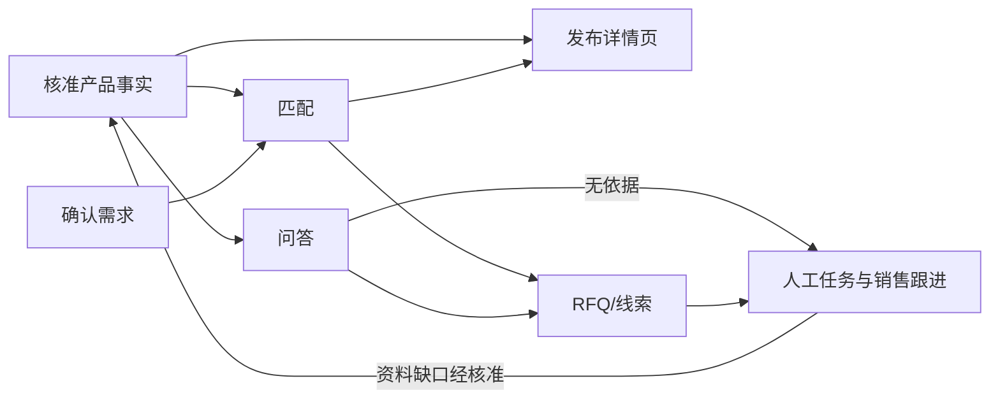

# 跨境工业品 AI 售前平台｜最小 MVP 开发需求文档

**版本**：草案 0.3 · 2026-09-30  
**状态**：供产品确认与开发拆解，第 8 节列出正式试点前需要逐步确定的事项，不要求用户现在一次性填写。  
**目标**：用工业水泵证明一条询盘能从自然语言需求进入产品推荐、可信问答、RFQ 或待培育线索，并由销售接手。当前水泵资料和演示不能替代正式授权、企业核准或客户验证。

**长期产品关系**：本 MVP 聚焦「售前转化层」；获客层的内容生产与主动开发、销售运营层的智能培育与 CRM 集成，记录在 [长期功能代办备忘录](长期功能代办备忘录.md)。这些功能与 MVP 共用核准产品知识、买方需求和销售事件，但不因列入路线图而视为本轮已开发。

**技术实现边界**：产品事实来源、企业数据隔离、版本快照、模块接口与失败回退见 [技术架构草案](技术架构草案.md)。该文是开发前的结构建议，不指定技术栈或要求 MVP 拆分微服务。

**可靠性开发顺序**：自动备份与恢复演练、模型故障转人工等当前要做的措施，以及双模型、双实例、数据库高可用的启用条件，统一记录在 [架构决策记录](架构决策记录.md)；不要从候选方案直接推断 MVP 全部必须采购。

## 1. 边界与成功定义

### 1.1 用户与入口

| 角色 | 在 MVP 中完成的事 |
| --- | --- |
| 企业管理员/产品负责人 | 导入资料、核对技术字段、发布产品页 |
| 买方 | 描述需求、补充工况、查看推荐页、提问、提交 RFQ 或留下待跟进需求 |
| 销售 | 查看线索完整上下文、分配负责人、记录下一步与跟进日期 |
| 售前工程师 | 回答系统不能确认的技术问题，指出资料缺口 |

演示入口先采用网页对话。其他渠道暂通过手动填写来源标签进入统一记录；真正的平台消息收发、自动邮件和 CRM 同步不在 MVP 内。后台默认中文，买方界面默认英文；两侧均保留中英切换按钮。技术事实及引用保持原文可查，翻译内容不得改变参数和单位。

### 1.2 可验收的端到端场景

1. 管理员导入至少 **2 个有不同适用条件的示例水泵型号**，修正并核准关键字段，发布带有初步seo和geo的各自详情页。仅有一个型号不足以验证“从产品库匹配”的功能。
2. 买家进入询盘页面 发送消息/描述用途、流量和扬程。系统自动回复并提取明确给出的条件，追问会改变匹配结论的缺项，并让买方确认需求摘要。
3. 系统给出有依据的初步推荐、未确认条件及该型号固定详情页；条件不足或无可靠候选时不强行推荐。
4. 买方问一个资料内问题：显示答案及来源。再问一个资料外或需工程判断的问题：说明暂时无法确认，需要时间确认，同时在后台生成带上下文的聊天简报并唤起人工接参与任务。
5. 买方提交结构化 RFQ，或保留尚在调研的线索，（若对话在买家侧中断且持续无后续回复则标记为正在调研）。销售能在工作台查看每个客户对话涉及的产品、工况、问答、缺项、来源、负责人、阶段和下一步等销售线索。
6. 页面刷新或重新登录后，已保存的产品、RFQ、线索和处理状态仍可读取。演示不依赖固定脚本顺序才能走通。

**成功不等于**订单成交或效率提升。MVP 只验证流程是否准确、可理解、可追踪；商业效果需要试点测量。

## 2. 按用户旅程拆分的模块

| 模块 | 主要界面 | 关键功能 | 核心输出 |
| --- | --- | --- | --- |
| M1 产品资料导入与核准 | 企业后台：产品列表、导入向导、字段核对页 | 上传/分类 PDF、表格、图片和 CAD；抽取字段；显示原文件位置；人工修正、核准与禁用字段 | 已核准的产品事实、来源与版本 |
| M2 产品详情页 | 企业后台：页面编辑/预览；买方：产品页 | 选择展示维度；参数、曲线、应用示意、2D/3D 与原文件入口；发布固定链接 | 可分享的产品页版本 |
| M3 对话与需求识别 | 买方：聊天及需求摘要卡 | 记录原话与来源；抽取品类、用途、工况；区分已确认/推测/缺失；有限追问与确认 | 结构化需求 |
| M4 匹配与推荐 | 买方：推荐卡；后台：匹配依据 | 用核准字段筛选候选；展示满足项、冲突项、未确认项；发送理由和详情页 | 推荐结果或不可推荐原因 |
| M5 资料问答与人工接管 | 买方：问答；后台：待处理任务 | 只用核准资料回答并给出处；无法确认时转人工；保留上下文及回复 | 有来源的答案或人工任务 |
| M6 RFQ 与待培育线索 | 买方：询价表单/暂存入口 | 预填已确认工况；收集数量、地区、期望交期、联系方式；保存 RFQ 或待培育状态 | 可处理的询价/线索 |
| M7 销售工作台 | 企业后台：线索列表与详情 | 查看全链路记录；负责人、阶段、下一步、跟进日期和备注；处理人工任务 | 持续跟进记录 |

## 3. 模块功能与验收标准

### M1 产品资料导入与核准

**功能**：上传资料并自动关联型号；抽取、人工编辑水泵必要字段（至少流量范围、扬程范围、介质适用条件及资料来源）；保留原值、修正值、来源文件与位置、核准人和核准时间；发布/撤回核准状态。CAD 可作为附件与预览素材，不要求自动从 CAD 精确抽取工程参数。

**验收**：

- 上传后能看见文件归属的产品、类型与处理状态；抽取失败可手工录入，不会被默认为已核准。
- 管理员可从任一对外参数回到对应文件及位置；缺失、冲突或未核准字段有明显标记。
- 未核准字段不得成为匹配依据、公开参数或 Agent 的确定性答案。修改已发布关键字段后需重新核准并生成可识别版本。

### M2 产品详情页

**功能**：固定产品页模板；企业选择展示字段通过预设好的提示词生成产品展示页面并预览或发布；买方查看型号、用途、关键参数、曲线、材质、应用示意、可用可互动的 2D/3D 展示和对应的资料下载；显示版本/来源及“初步展示，正式选型需确认”的边界。

**验收**：

- 推荐链接打开对应型号与已发布版本；未发布页不能被买方公开访问。
- 页面技术字段与当前已发布的核准资料一致；缺失的媒体不显示虚假占位能力。
- 移动端和桌面端均兼容并可读，核心参数与继续提问/询价入口可找到；可下载资料指向正确文件。
- 同一产品的产品详情页面内容除非用户重新发布同一型号产品覆盖当前页面否者 同一产品的产品详情页面可复用，本次客户的工况说明单独呈现，不写回产品通用事实。
- 页面生成须先进入预览与核准，不能仅凭提示词直接公开技术结论；初步 SEO/GEO 仅指该产品页的清晰标题、结构化信息、可读技术说明与可分享链接，不包含成批生成搜索落地页或保证搜索/AI 推荐结果。
- 对已有且获准使用的 STEP/DXF 等文件，提供与型号关联的预览或下载；若浏览器无法直接显示某格式，应提供经核对的可视化衍生文件或原文件下载。不得把示意模型标为原厂工程 CAD。

### M3 对话与需求识别

**功能**：保存买方原话；识别水泵需求字段并显示结构化摘要；针对缺失关键条件追问；允许买方改正；记录来源渠道和买家角色（角色可留空、可由销售修正）。

**验收**：

- 系统不会把推测值写成买方已确认值；每个用于匹配的条件可追溯到买方输入或确认动作。
- 缺少影响推荐的条件时先追问或标记未知；买方拒答后仍可继续转人工或保存线索。
- 需求摘要变化后，已有推荐失效并重新计算；历史原话保留。

### M4 匹配与推荐

**功能**：MVP 用可查看的品类规则与核准字段做初步筛选；候选可为多款；给出匹配理由、冲突条件、待确认条件；结果分为“可初步推荐”“条件不足”“无可靠候选”。

**验收**：

- 相同产品数据和已确认工况产生可重复的结果；销售可查看使用的字段与规则。
- 关键条件冲突时不输出“适用”；条件不足时不将未知视为满足。
- 推荐卡包含型号、理由、未确认项和正确的详情页链接；无候选时唤起人工接管。
- 规则和阈值须由相应产品负责人或工程师核准；演示规则不能被标成正式选型方法。

### M5 资料问答与人工接管

**功能**：按推荐型号检索已核准资料；回答时给文件、页码/位置、版本；资料不足或需个案判断时承认不能确认并创建来攻拉起任务；工程师在后台回复或标记资料缺口。

**验收**：

- 已知测试问题的答案与引用原文相符；引用能打开到正确资料位置或清楚指向对应文件。
- 对资料不存在、冲突或无法判断的问题不编造参数、认证、价格或交期。
- 任务包含原问题、买方已确认工况、推荐型号、已回答内容及缺失原因；销售/工程师可看见处理状态。
- 人工答复不会自动变成产品通用知识，须走 M1 核准。

### M6 RFQ 与待培育线索

**功能**：从对话和推荐预填已确认工况、型号及待确认项；补充数量、目的地、期望交期、联系方式及自由说明；买方确认摘要后提交。尚未准备询价时可在获得联系信息及相应同意后保存待培育线索。

**验收**：

- 预填值与已确认需求一致，买方可改；修改关键工况后重新评估推荐。
- 必填字段的具体清单按水泵试点报价流程由企业确认；缺字段时显示“待补充”，不误标“可报价”。
- 提交后生成唯一记录；重复点击不产生重复 RFQ；后台能检索并打开。
- 联系信息只在授权的企业后台可见；买方可看见提交结果与下一步说明。

### M7 销售工作台

**功能**：线索列表、详情、来源、当前阶段、负责人、跟进日期、待处理技术问题和操作记录；销售可修改阶段、记录备注、安排下一步；工程师可回复被分配的问题。

**验收**：

- 从任一 RFQ 或线索可查看完整需求、推荐、页面版本、问答与人工任务，无须跨系统拼接。
- 新线索在列表中可识别；保存负责人、阶段和日期后刷新不丢失；逾期任务有可见标记。
- 后台用户只能访问所属企业的数据；关键变更至少记录操作者与时间。

## 4. 模块联动与状态规则

**单一事实来源**：页面、匹配和问答都引用同一份核准产品版本。**会话快照**：RFQ 保存提交时的产品版本、需求与推荐结果；产品后续更新不应悄悄改写历史询价。**状态划分**：产品草稿/待核准/已发布/已撤回；需求待确认/已确认；推荐可初步推荐/条件不足/无可靠候选；人工任务待处理/处理中/已答复；线索待跟进/技术确认中/待买方补充/可报价/暂缓。状态名可在试点中调整，状态间必须保留操作者与时间。

## 5. 前端 UI 与功能关联

**产品内完成业务操作（用户已确认，2026-09-30）**：本阶段承诺的功能必须通过正式产品界面及其后台流程完成。企业成员和买方通过按钮、表单、导航、产品内对话及明确的状态反馈操作；模块之间的数据由程序按已保存对象自动传递。这里的产品内 Agent 是软件功能，不是当前开发助手。开发阶段与助手的对话不作为产品运行依赖。

验收时，由测试者仅使用产品界面走通“上传、核准、发布 → 买方需求确认 → 推荐与产品页 → 有据问答或人工任务 → RFQ → 销售处理”。不能要求测试者在开发聊天里发指令、运行脚本或让开发助手手动搬数据才能完成这些业务步骤。后台自动作业可以由用户操作或业务事件触发，进度、结果和失败处理应在产品界面可见；人工接管由工程师在工作台处理。刷新后仍能读取按验收要求保存的状态。仅有界面原型或模拟数据时须明确标注，不能据此宣称功能已通过完整产品验收。

| 页面/区域 | 信息层级与交互 | 对应模块 |
| --- | --- | --- |
| 企业产品列表 | 型号、核准状态、资料版本、页面发布状态、资料缺口；进入导入/编辑 | M1、M2 |
| 导入与核对页 | 左侧原文件预览，右侧提取字段与来源；差异、缺失、核准动作明显 | M1 |
| 产品页编辑/预览 | 后台选择展示区块；买方视角预览；发布版本及链接 | M2 |
| 买方对话页 | 对话为主；需求摘要卡区分“已确认/待确认”；推荐卡展示依据、限制和详情页 CTA；提供中英切换 | M3、M4 |
| 买方产品详情页 | 首屏型号、用途和本次推荐理由；参数/曲线/图纸/3D 分区；持续可见提问与 RFQ 入口 | M2、M5、M6 |
| RFQ 表单 | 已知字段预填并标来源；未知条件单独列出；提交前摘要 | M6 |
| 销售工作台 | 列表按待处理与跟进日期排序；详情将需求、推荐、问答、RFQ 和时间线放在同一视图 | M5、M6、M7 |

视觉方向已由用户确认（2026-10-02）：采用类似 Kevvee 公开页面的深色创意工作台语言——深色网格背景、紫色渐变强调、半透明深色卡片、圆角边框和克制的顶部导航；仅借鉴布局与视觉语言，不复制其品牌资产或页面内容。无论采用何种风格，界面都应清楚区分**产品事实、AI 提取、买方确认和人工判断**；技术引用、错误与待确认项不得仅靠颜色表达。语言切换不清空已填工况、RFQ 或对话；切换后的页面标签、表单提示和状态文案应一致，原始资料引用可保持原语言并标明。

## 6. 数据、权限、质量与测量

- **基本对象**：企业、后台用户、产品/型号、来源文件、核准字段、页面版本、会话、需求、推荐、答案/引用、人工任务、RFQ、线索、跟进记录。可按实现需要合并表，但不能混淆产品事实与买方数据。
- **权限**：买方只访问公开页及自己的会话结果；企业成员仅看所属企业数据；企业用户权限分类，管理员账户可以控制同组织内其他账号对各个功能的访问权限，例如：发布和核准由授权角色操作。MVP 至少具备登录、租户隔离和操作记录。
- **数据保护**：上传文件、联系方式、会话和 RFQ 不得出现在其他企业的公开页面或响应中；演示使用模拟个人信息。正式试点的数据保留、删除、跨境处理规则需单独确认。
- **基本事件**：入口来源、需求摘要确认、推荐展示/拒绝推荐、详情页打开、问答有据/转人工、RFQ 提交、线索分配和跟进完成。事件用于发现流程问题，不把 Demo 行为称作转化率提升。
- **验收证据**：每个端到端场景应保存输入、页面截图/录屏、匹配依据、引用来源和后台记录；同时测试缺字段、冲突、无候选、重复提交与跨企业访问。

## 7. 明确不在 MVP 内

WhatsApp/微信/Telegram 正式接入；自动搜寻潜客和冷邮件；
**自动营销序列**（按预设时间与条件连续向潜客发送多封营销/培育消息；MVP 仍记录销售下一步和跟进日期）；
**SEO 内容批量生成与发布**（MVP 可以把已核准资料用于单个产品页和 FAQ，不建设关键词研究、成批页面生产与 SEO 成效管理流程）；
实时价格库存；自动报价/下单/付款；
**复杂 CRM 双向同步**（MVP 内保存线索与跟进记录，允许后续增加导出；暂不让本平台与外部 CRM 互相自动更新客户、商机和阶段）；
**从不完整资料自动生成工程 CAD 模型**（已有且允许使用的 STEP/DXF 文件预览、交互展示及下载属于 M2）；
合同法律结论；对所有工业品的通用选型器。

上述暂缓项是后续产品机会，不是被否定的价值。它们的用途、所属模块、前置条件与进入开发的验证条件见 [长期功能代办备忘录](长期功能代办备忘录.md)。

### 7.1 MVP 为后续功能保留的连接点

| 后续方向 | MVP 已需保留的结构 | 本轮不做的部分 |
| --- | --- | --- |
| 产品知识驱动的 SEO/应用内容（F-01/02） | 核准技术事实、产品页版本、可分享链接与入口来源；单页初步 SEO/GEO | 批量选题、生成、发布和流量归因平台 |
| 有上下文的跟进（F-04/05） | 买方确认工况、页面/资料互动、问题、RFQ、负责人及下一步事件 | 自动判定采购阶段及未经审核的连续对外发送 |
| CRM 对接（F-06/07） | 稳定的线索/RFQ ID、阶段、负责人、记录时间和可导出的字段 | 特定 CRM 的字段映射、授权、冲突处理与双向同步 |
| CAD 深度交互（F-08/09） | 已有模型与产品型号/资料版本关联、可预览或下载 | 部件级语义映射与点击部件问答 |
| 新 CAD 生成（F-10/11） | 明确原厂文件、审核状态与示意素材的来源区别 | 参数化工程模型或 AI 推测模型自动生成 |

这张表是数据与验收边界，不要求为未来功能提前搭建通用框架。后续是否进入开发，应根据试点需求和 [长期功能代办备忘录](长期功能代办备忘录.md) 的条件决定。

## 8. 以后需要确定的事项（现在不用逐项填写）

（此部分不是要求现在修改文档的问卷。它们是提醒开发团队：**哪些具体规则不能由 AI 或程序员替企业拍板**。当前先按表中“暂时怎么做”推进；到了设计视觉、接入真实工厂或对外发布的相应阶段，再由合适的人确认。你也可以随时直接在文档里批注或在聊天中告诉我决定，我会同步更新。）

| 说白了要决定什么 | 谁来决定、什么时候决定 | 暂时怎么做 |
| --- | --- | --- |
| 英文产品说明由谁检查？例如材料、单位或适用条件的英文有没有翻译错。 | 找到试点工厂后，由其懂产品的负责人或工程师在对外发布前检查；现在不需要你承担技术审核。 | 页面可做中英切换；未经核准的英文技术说法只作演示，不标为正式资料。 |
| 页面要长什么样？例如品牌色、字体、图片风格。 | 你在开始高保真 UI 设计前决定或提供参考；目前你已决定先定布局和交互、风格暂缓。 | 先设计信息排列、按钮和操作路径，不擅自确定品牌视觉。 |
| 推荐水泵前必须问哪些使用条件？什么数值算符合或不符合？“工况”就是介质、流量、扬程、供电等实际使用条件；“匹配阈值”就是选型判断规则。 | 真正试点时由工厂工程师确认；不能由产品经理或 AI 凭空设定正式选型规则。 | Demo 可以展示清楚标注的示例规则；缺少关键条件时追问或转人工，不宣称正式适配。 |
| 买方提供哪些信息后，工厂才足以开始报价？RFQ 就是买方发给工厂的询价请求。 | 试点工厂的销售与售前人员在接入真实报价流程前确认。 | 先收集产品、工况、数量、交付地区、期望时间和联系人等候选信息；不足时标“待补充”。 |
| Agent 答不了时通知谁、用什么方式通知、多久回复？“响应目标”是企业承诺的处理时间。 | 试点工厂确定负责人、工作时间和通知方式后确认；MVP 演示不做回复时限承诺。 | 先在后台生成带上下文的待办任务，让人能看到和处理。 |
| 用哪家企业的真实产品做试点？资料是否允许放到页面上给买方看？ | 找到试点工厂并取得资料使用与展示许可后确认。 | 当前水泵只作为本地概念 Demo，不暗示厂商授权或合作。 |

## 9. 开发切片建议

先打通 M1 核准数据与 M2 页面，再做 M3/M4 的需求和匹配，接着完成 M5 问答/移交，最后做 M6/M7 保存及后台闭环。每一切片都要使用同一产品版本和会话 ID 验证数据传递；不要等全部 UI 完成后才串联。
