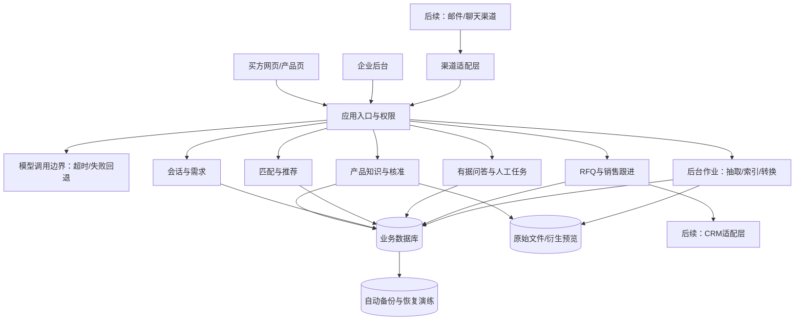

# 跨境工业品 AI 售前平台｜技术架构草案

**版本**：草案 0.2 · 2026-09-30  
**状态**：讨论稿，供“国内先测、海外后测”的分阶段技术评审；不是已选云服务、可用性承诺或已实现系统。  
**对应文档**：[MVP 开发需求文档](MVP-开发需求文档.md) · [第一版完整功能开发需求文档](V1-完整功能开发需求文档.md) · [长期功能代办备忘录](长期功能代办备忘录.md) · [架构决策记录](架构决策记录.md)。冗余措施的当前优先级以决策记录为准，本草案解释技术原因。

## 1. 为什么现在需要技术架构

业务架构回答“用户经历哪些步骤、产品提供什么功能”；技术架构回答“数据由谁维护、模块怎样交互、失败后怎样恢复、未来接入新渠道时改动哪些地方”。本项目的主要变更风险不是页面数量，而是**同一型号的事实被页面、推荐、Agent 和销售记录各存一份**，或外部渠道/CRM 直接改写内部业务状态。

现在应确定**少量难以事后修补的边界**：企业数据隔离、核准事实的单一来源、产品和会话的版本快照、外部消息去重、人工审核关口，以及部署地域与客户数据所属地的区别。具体框架、云厂商、数据库高可用规格和服务拆分方式，等测试规模与恢复要求清楚后再决定。

用户已明确首版服务**国内工业品卖家、海外买方**，后续开展海外版本公开测试。因此后台默认中文、买方默认英文的既有要求仍成立。卖方所在市场、买方访问所在地、数据部署地域是三个不同概念。国内版与海外版应尽量共享核心业务代码，但**不能预设仅换界面与配置就能上线**：部署地域、模型服务、消息渠道、身份方式和数据规则可能不同。

## 2. 建议的起步形态

**建议：一个可部署的模块化应用，配托管数据库、文件存储和处理耗时任务的后台作业。** 买方页面与企业后台可以是同一应用的不同界面。应用进程不保存唯一一份会话或任务状态，方便重启和扩容；持久状态保存在数据库/对象存储。Redis、第二台应用实例、数据库热备与负载均衡按阶段和恢复目标启用，不把它们全部写成封闭试点的强制前提。

图中的框是**代码与数据责任边界**，不代表每个框都要单独部署。模型调用边界先统一请求、超时、错误和结果记录；接入第二家模型要在同任务质量测试后决定。第一版才按最终选定的外部渠道实现适配层；未来 CRM 写入从内部稳定的 RFQ/线索记录出发。

## 3. 模块归属和禁止的直接依赖

| 技术模块 | 自己负责的数据/规则 | 对其他模块提供什么 | 不应做什么 |
| --- | --- | --- | --- |
| 企业与身份 | 企业 ID、成员、角色、授权 | 当前企业与操作者上下文 | 让前端传来的企业 ID 单独决定权限 |
| 产品知识 | 原文件、型号、字段、来源、核准状态、版本 | 只读的已发布产品事实与附件许可 | 让页面、Agent 各自维护另一套“真实参数” |
| 页面发布 | 页面草稿、内容区块、公开版本与链接 | 按产品版本读取已核准内容 | 改写产品知识或把单个买方工况写成产品事实 |
| 会话与需求 | 原消息、来源、已确认/推测/缺失的工况、需求修订 | 给匹配和 RFQ 的已确认需求快照 | 把模型抽取结果直接当买方确认 |
| 匹配与推荐 | 规则版本、候选、满足/冲突/未知项、推荐快照 | 解释性推荐结果 | 仅凭生成式回答决定正式工程选型 |
| 问答与人工任务 | 检索引用、回答、无法确认原因、任务处理 | 有据答案或人工任务 | 未经核准新增通用产品事实 |
| RFQ 与销售 | 询价、线索、阶段、负责人、下一步及操作历史 | 稳定的业务记录供后台与未来 CRM 使用 | 让外部 CRM 直接成为内部产品事实来源 |
| AI 调用边界 | 按任务的输入输出格式、模型版本、超时、错误及成本记录 | 提取/起草/问答的统一调用结果 | 把所有模型输出直接当成核准事实，或盲目重试造成重复写入 |
| 外部集成 | 渠道/CRM 标识映射、入站去重、发送状态和失败重试 | 标准化消息或受控导出 | 绕过内部规则直接改写推荐、RFQ 或权限 |
| 地域配置 | 界面语言、日期/时区、渠道与模型可用性、部署环境的配置 | 各市场的可见功能与服务选择 | 把 `tenantId`、买方国家和服务器所在地当成同一个字段 |

模块之间可以在同一进程中直接调用明确的函数/接口。**先划责任，不先造网络服务。**若以后某模块因流量、团队分工或独立发布需求而必须拆出，再根据真实边界迁移。

## 4. 从资料到销售的关键数据契约

最少要有稳定标识：`tenantId`（企业）、`productId`/`modelId`、`productVersion`、`pageVersion`、`sourceDocumentId`、`conversationId`、`requirementRevision`、`recommendationId`、`rfqId`、`taskId`。命名可调整，但关系不能只靠页面文字或文件名拼接。另需在部署/企业配置中区分 `sellerMarket`（服务的卖方市场）、`buyerLocale`（买方界面语言/地区）和 `dataRegion`（数据存放区域）；这些不是可互相替代的租户隔离字段。

1. **原文件不可悄悄覆盖。** 上传新手册保留原文件、文件版本和来源；抽取结果是草稿，经人工核准后形成可引用的产品事实。
2. **页面、匹配、问答读取同一已核准产品版本。** 可以为检索创建索引，但索引是可重建副本，不能成为另一套权威数据。
3. **需求分层。** 原消息、AI 提取候选值、买方/销售确认值分别保存；推荐只把确认值当已知条件，未知值保持未知。
4. **推荐与 RFQ 留快照。** 保存当时的需求修订、产品版本、匹配规则版本、理由和未确认项。产品后续修订不能静默改变过去发给买方的判断。
5. **人工回复与产品知识分开。** 工程师针对某次询盘的答复先属于该会话；若具有通用性，须通过产品知识核准流程才能用于新会话。
6. **文件来源与用途分开。** 原厂 CAD、经审核的参数化模型、仅供展示的推测模型必须有不同来源标识和下载权限；详情见长期备忘录 F-08 至 F-11。

### 4.1 建议记录的最小状态变化

`产品事实核准/撤回`、`页面发布/撤回`、`需求确认/更正`、`推荐生成/失效`、`问答有据/转人工`、`RFQ 提交`、`线索分配/阶段变化/跟进完成`。业务对象保留当前状态，同时保留关键变化记录及操作者、时间。MVP 可以先用数据库中的状态表和操作日志实现，不必为这些事件部署专门的消息平台。

## 5. 两条需要特别保护的流程

### 5.1 产品知识发布

`上传原文件 → 提取字段/生成页面草稿 → 人工核对来源与翻译 → 核准产品版本 → 发布页面 → 更新可检索索引`

若抽取、转换或索引失败，草稿保留且显示失败原因；未核准字段不进入公开页、匹配或确定性回答。索引更新未完成时，应使用旧的已发布版本或告知暂不可回答，不能混用两个版本拼接结论。

### 5.2 买方询盘

`入站消息 → 保存原文及来源 → 提取/确认需求 → 规则匹配 → 保存推荐快照 → 发送产品页 → 有据问答或人工任务 → RFQ/待培育线索 → 销售跟进`

同一外部消息或 RFQ 重试提交不得创建重复记录。外部消息接入失败、Agent 不可用或检索无依据时，保存已收到内容并交人工处理；不能把“技术故障”包装成“产品不适用”。

2026-10-02 的 M3/M4 实现把“提取/确认需求”和“规则匹配”落在同一模块化单体中：原话写入 `messages`，结构化候选与确认值写入带序号的 `requirement_revisions`，匹配只读取确认状态和已发布 `product_versions`，结果写入 `recommendations` 快照。当前 `pump-demo-v1` 是显式标记的演示规则；缺少流量、扬程或介质时返回条件不足，冲突项不会被当作满足项。需求再次确认后生成新修订并使旧推荐失效，避免历史结果被静默改写。

## 6. 与未来功能的连接方式

| 未来能力 | 现在必须留下什么 | 以后再决定什么 |
| --- | --- | --- |
| SEO/应用页 | 核准产品事实、页面版本、语言审核、入口来源 | 内容编辑器、发布目标、关键词研究和归因规则 |
| 智能跟进序列 | 会话、页面/CAD 互动、问题、RFQ、负责人和同意状态的关联记录 | 自动发送条件、渠道、停止规则与审核方式 |
| CRM 双向同步 | 稳定的线索/RFQ ID、阶段和变更历史；导出字段 | 首个 CRM、主数据归属、字段映射、冲突策略 |
| 点击 CAD 部件问答 | 文件与产品版本关联、附件来源标识 | 模型部件 ID、语义映射、 Viewer 交互形式 |
| 新 CAD 生成 | 原厂/生成/示意三类来源和审核状态 | 品类模板、尺寸完整性、工程验收和责任边界 |

未来真正连接外部渠道或 CRM 时，再实现**适配器**。所有入站消息转换成内部统一会话格式；所有对外发送基于已保存的内部记录，并保留外部消息 ID、发送状态和重试信息。若外部写入与本地保存必须保持一致，再评估事务外盒等可靠投递做法，不需要在纯网页 MVP 中预装复杂消息基础设施。

## 7. 安全、权限与可排错性

- **企业隔离**：从登录态取得企业上下文，数据查询、文件访问、检索、后台作业和导出都限制在该企业；仅在前端隐藏按钮不构成权限控制。
- **买方隐私**：公开产品页与私人会话/RFQ 分开；分享产品链接不能暴露上一位买方的工况或联系信息。
- **有据生成**：模型负责提取草稿和组织语言，不能绕过核准数据、匹配规则和人工关口。
- **可排错**：一次询盘至少能沿 `conversationId → requirementRevision → recommendationId → productVersion → answer/RFQ/taskId` 追踪；后台作业和外部发送有状态与失败原因。技术日志避免记录不必要的完整个人信息。
- **可替换的依赖**：模型供应商、文件转换器和具体渠道放在边界后面；业务对象与规则不使用供应商专有格式保存。不要为了“可替换”先开发多个供应商实现。

## 8. 对所提供冗余建议的判断

用户提供的建议正确指出了模型依赖、数据丢失、单点故障和未来地域扩展风险；其中的具体比例与成本不能直接用于本项目的预算或可用性承诺。

| 建议中的说法 | 本草案的处理 |
| --- | --- |
| “AI 故障 80% 来自模型接口”“双模型几十行代码解决 90% 波动” | 未见针对本产品的故障记录，不能当统计事实。先记录各任务的错误、超时和质量；若 AI 持续可用是试点要求，再给经同任务测试的备用模型做路由。无论是否双模型，都保留人工接管。 |
| “高频结果放 Redis，模型全故障仍可回答” | 只缓存可复用且有版本的公开产品内容/已核准 FAQ；按企业、产品版本、语言和内容版本隔离。带客户工况、私人资料或过期技术版本的回答不能直接共享缓存。Redis 是可选实现，不是权威资料库。 |
| “数据库一主一从，故障时从库接管且数据几乎不丢” | 必须先区分**高可用备库**与**异步只读副本**。后者可能有复制延迟，不能直接承诺近零丢失；单可用区的两台机器也不能覆盖整个可用区故障。封闭试点先保证自动备份和恢复演练；公开测试再按恢复目标选择托管高可用方案。 |
| “两台应用服务使可用性从 99% 到 99.9%” | 两实例只能降低单实例故障风险，数据库、负载均衡、区域和模型仍可能共因故障；没有故障数据和架构测量，不能推出具体百分比。 |
| “模块化单体中某个模块故障不影响全局” | 代码边界有利于定位问题，但同一进程仍可能被崩溃、阻塞或资源耗尽波及。对模型、文件转换和外部渠道设置超时、隔离后台作业与失败状态；需要更强运行时隔离时再拆进程。 |
| “国内/海外换适配层即可，核心代码零改动” | 共享业务核心是合理目标；不同市场的身份、模型、渠道、语言、数据处理和部署仍需测试与调整。不要 fork 两套长期分叉的代码，也不要承诺零改动。 |

## 9. 按测试阶段落实冗余

用户已选择**国内卖家＋海外买方的小范围试点，允许短时维护**。因此“数据可恢复”和“故障不说错话”优先于“所有组件双机在线”。

| 阶段 | 必须落实 | 条件满足后增加 | 不预设 |
| --- | --- | --- | --- |
| 国内小范围 MVP 试点 | 模块化单体；应用进程无唯一业务状态；托管数据库自动备份与一次实际恢复演练；原文件安全存储；模型超时/错误可见并转人工；关键日志与监控；中英界面文案独立于业务代码 | 经验证的第二模型、第二应用实例或更高数据库规格：由试点不能容忍的中断类型决定 | 主从数据库、双实例负载均衡、Redis、K8s、多可用区都不是默认门槛 |
| 国内更大范围公开测试 | 根据目标恢复时间/可丢失数据量选托管数据库高可用和备份；若需单实例故障不停服，运行两台无状态应用并接负载均衡；检查海外买方访问体验与模型质量 | 跨可用区部署、独立备份副本、备用模型：按故障风险、预算和供应商能力评估 | “两台=99.9%”或“单区一定够”的固定承诺 |
| 海外版本公开测试 | 同一核心代码分环境部署；明确海外数据、文件、索引、日志、备份的所在地；配置当地可用模型和渠道；迁移/复制有审批与测试 | 独立地域数据库、多地域灾备和付费/合规适配：根据市场、规模与核验结果实施 | 从国内数据库自动复制全部数据到海外或仅换一个域名就上线 |

**在公开测试前确定两个业务指标**：可接受服务中断多久（恢复时间目标，RTO）和最多能接受丢失多久以前的新增数据（恢复点目标，RPO）。它们决定数据库高可用、备份频率、跨区副本与预算。封闭试点先记录恢复操作实际耗时与数据损失，不凭经验给出分钟级承诺。

## 10. AI 能力与缓存的具体边界

按任务拆分调用：资料抽取、页面草稿、需求字段提取和有据问答使用同一**模型调用边界**，但允许各任务分别配置模型、提示词版本、超时、重试与质量样例。产品匹配的硬条件仍由核准规则判断；模型不能通过“路由切换”获得修改产品事实的权限。

- **最小降级路径**：短暂重试只用于可安全重放的读取/生成任务；超时、限流、模型异常或证据不足时保存原始输入并转人工。外部消息发送和 RFQ 写入使用去重键，不能因重试产生第二份记录。
- **第二模型的条件**：先用相同的资料抽取和问答样例检验答案正确性、引用能力、字段格式、价格、延迟与数据处理范围；只在该任务达到可接受质量后启用自动切换。故障恢复后切回也需健康检查，不按一次成功立即反复切换。
- **缓存的安全边界**：固定产品页和公开、已核准 FAQ 可按 `tenantId + productVersion + locale + contentVersion` 形成缓存键；产品撤回/更新后失效。带具体客户工况、联系方式、会话内容或未核准资料的回答不跨客户共享缓存。
- **成本与可观测性**：记录任务、模型、版本、请求状态、耗时和费用估计，不在普通技术日志中保存不必要的完整客户问题。

## 11. 数据、应用与备份的具体边界

- **数据库**：权威业务数据放托管数据库；先启用供应商支持的自动备份/时间点恢复能力，并定期把备份恢复到隔离环境验证。备份计划覆盖恢复权限、保留期、误删和数据库损坏，而不只检查“备份任务成功”。高可用备库、只读副本和备份承担不同目的，不互相替代。
- **文件**：原手册、CAD、衍生预览及其版本保存在对象存储；数据库记录文件 ID、哈希、所属企业、可见范围和产品版本。对外发布、删除或迁移时要同时检查数据库记录与文件权限。需要独立备份位置时按试点风险和成本选择，不能假定任意对象桶天然与主系统物理隔离。
- **应用进程**：会话、RFQ、任务和作业状态持久化；进程重启不能丢业务数据。第二实例可在需要时增加。缓存不能成为唯一的业务状态存放处。
- **后台作业**：资料解析、索引、CAD 预览转换异步处理，显示待处理/成功/失败状态，可安全重试；同一文件重复触发不产生互相冲突的已发布版本。
- **监控与演练**：至少监控页面/接口、数据库连接、模型请求、后台作业、文件读取和待处理人工任务；对模型故障、应用重启、数据库恢复、误删恢复分别做演练。故障源不同，回退方式也不同。
- **部署复现**：用可重复的构建、锁定依赖和环境配置运行；容器镜像是合适选项，但首轮不把 Docker/K8s 本身当产品验收目标。

## 12. 国内先测与海外后测的地域边界

**共享一套产品核心，分环境部署和配置。** 代码层先支持后台中文、买方英文以及切换；界面文案、系统提示、通知模板与审核后的技术译文分开管理。语言配置能减少后续改动，但新增语言仍需翻译、审核和端到端测试，不能只增加一个配置文件就视为完成。

地域差异采用**已有需求才建接口**的方式处理：模型服务和入站渠道现在就有真实差异，可封装为适配层；微信/手机号登录、支付、短信、实名认证等尚未进入 MVP 的能力，不提前写空的通用接口。海外版本若引入新的身份或支付方式，再根据选定市场和业务场景设计。

`tenantId` 用于企业隔离，`sellerMarket` 表示卖方市场，`buyerLocale` 控制界面语言，`dataRegion` 表示数据部署区域。海外买方访问国内部署的页面，并不自动意味着该买方数据属于海外版；反过来，海外公开测试也不能只在同一数据库里加一个 `market` 字段就认定完成物理隔离。若决定分地域部署，数据库、对象文件、检索索引、日志、备份和密钥都需纳入迁移方案。具体的数据处理与市场规则在公开测试前另做专业核验。

## 13. 现在要决定与可以稍后决定的内容

| 现在需在开发前统一 | 可以等首个试点/实现选择时决定 |
| --- | --- |
| 哪份数据是核准的产品事实；谁能核准/撤回 | 具体前后端框架、云厂商和部署服务 |
| 企业/买方数据边界与最小权限 | 关系数据库的具体产品、文件存储厂商 |
| 产品版本、需求修订、推荐和 RFQ 如何互相关联 | 是否需要专门的向量数据库、Redis、队列或事件总线 |
| 三种推荐结果及模型失败转人工路径 | 第二模型供应商、第一版接入哪家聊天平台或 CRM |
| 国内卖家＋海外买方的界面语言与地域元数据区别 | 海外版首个部署地域和具体身份/支付渠道 |
| 已有 CAD 与示意模型的来源标识 | 何时从单体拆分独立服务 |

**待用户确认的产品决策**仍以两份需求文档为准，例如外部渠道优先级、视觉风格和试点企业。上述技术草案不替用户选择这些事项。

## 14. 技术验收用例

1. 企业 A 无法通过猜测 ID、文件链接、搜索或后台任务读取企业 B 的产品、会话与 RFQ。
2. 未核准或已撤回的事实不能生成新推荐或新确定性答案；旧 RFQ 仍显示原来使用的版本。
3. 买方更正流量/扬程后，旧推荐被标为失效，重新匹配并保留变更记录。
4. Agent 无资料或依赖故障时不编造答案，人工任务包含可复盘上下文。
5. 同一消息或 RFQ 被重复投递/提交，不产生重复业务记录；失败状态可查。
6. 产品页链接不泄露私人会话；语言切换不改变型号、数值、单位或技术引用。
7. 从任一 RFQ 能追溯到原始询盘、需求修订、推荐理由、产品版本、答案引用和人工操作。
8. 关闭当前应用实例后重启，已提交的会话、RFQ、文件和人工任务仍完整；若配置了第二实例，访问可切换且不会丢会话状态。
9. 在隔离环境实际恢复一次数据库和关键文件，并记录恢复时间及最后一条可恢复业务记录；备份仅“显示成功”不足以通过验收。
10. 模型超时、限流或备用模型给出无来源答案时，系统不错误推荐、不虚构参数，并保留人工处理路径。
11. 同一公开产品问答在产品版本更新后不返回旧缓存；不同企业或不同客户的私有内容不会互相命中缓存。

这些测试验证的是**可持续修改的边界**，不是要求 MVP 建成大规模分布式平台。技术选型应在真实代码、团队能力和试点规模明确后另行记录为简短决策说明。

## 参考思路

- [Martin Fowler：Monolith First](https://martinfowler.com/bliki/MonolithFirst.html) 讨论新产品过早拆微服务带来的复杂度；本方案据项目规模作出“先单部署、内部分模块”的推断。
- [AWS：SaaS Tenant Isolation](https://docs.aws.amazon.com/whitepapers/latest/saas-architecture-fundamentals/tenant-isolation.html) 说明企业数据隔离需贯穿资源访问，而不仅是登录界面。本文不限定使用 AWS。
- [阿里云 RDS 高可用与灾备设计](https://www.alibabacloud.com/help/en/rds/product-overview/high-availability-and-disaster-recovery) 区分单区/多区主备、备份与读扩展；具体功能取决于所选版本与配置。
- [AWS RDS 只读副本](https://docs.aws.amazon.com/AmazonRDS/latest/UserGuide/USER_ReadRepl.html) 说明只读副本可以采用异步复制，不能简单等同于高可用备库。
- [AWS RDS 自动备份](https://docs.aws.amazon.com/AmazonRDS/latest/UserGuide/USER_WorkingWithAutomatedBackups.html) 说明时间点恢复能力；本项目仍需实测恢复过程。
