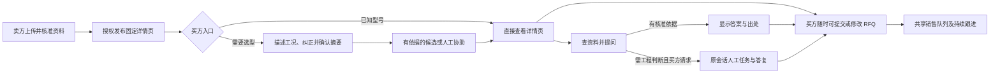

# 工业品 AI 售前平台｜客户旅程总览

**状态**：2026-10-02 访谈结论汇总；第 3 轮的详情页具体布局待调研，其余已确认边界见下文。所有功能在本仓库均未开发，本文不是上线说明。

本页把买方、卖方和售前工程师的操作连成一条路径，便于产品评审和端到端验收。**功能范围与详细验收以 [MVP 需求](MVP-开发需求文档.md)和 [V1 需求](V1-完整功能开发需求文档.md)为准；实现进度以[开发状态与变更记录](开发状态与变更记录.md)为准。**本页不能单独扩大 MVP 范围。

## 一眼看懂整条路径

这张图表示可走的路径，不要求买方每一步都按顺序完成。直接访问已知型号的买方可以跳过选型；RFQ 入口始终可用。

## 七轮讨论与正式需求的对应位置

| 轮次 | 已确认的产品决定 | 正式需求位置 | 尚未定案 |
| --- | --- | --- | --- |
| 1 入口与留资 | 已知型号可直接进公开页；对话加可编辑参数卡；普通浏览和问答不强制留资；网页人工请求可只在原会话看回复 | MVP M2、M3、M5、M6；V1 继承 | 具体英文话术需买方试读 |
| 2 澄清与推荐 | 一次追问最关键缺项；买方先确认已知值和未知标记；证据不足时可选人工或待核实候选；多候选并列比较 | MVP M3、M4；V1-04～06 | 水泵工程阈值由企业核准 |
| 3 产品详情页 | MVP 用预设模板并人工核准发布；V1 才做卖方 DIY 工作流、提示词和企业模板库 | MVP M2；V1-02、03；长期代办 F-13、F-14 | 买方页面首屏、区块顺序和交互布局待调研；行业数据库另议 |
| 4 人工协助 | 买方提交请求后建任务；等待时可继续问答；工程师在同一任务追问并自行决定答复 | MVP M5；V1-07 | 具体话术需试点验证 |
| 5 RFQ 与销售 | 任意阶段可询价、仅提交时确认联系方式；买方改原 RFQ，卖方看修订；共享队列；无整份撤回按钮，明确停联后暂停主动跟进 | MVP M6、M7；V1-08、09 | 联系方式清空规则待讨论 |
| 6 有限信息页 | 授权人员核准后可发布；是否进入推荐按核准技术证据分层，硬冲突不进入候选 | MVP M1、M2、M4；V1-02、03、06 | 具体品类规则需企业核准 |
| 7 跨页连续性 | 对话、详情页与 RFQ 保持同一会话；匿名买方仅同浏览器且访问凭据有效时返回；不自动跨设备找回 | MVP 第 1、5 节；V1 第 5 节；数据模型与技术架构 | 未来经核验的跨设备恢复是否开发待决定 |

以上“已确认”指需求决定，**不代表功能已经开发或通过验收**。旧决定及其更改原因在[开发状态与变更记录](开发状态与变更记录.md)中保留。

## 1. 卖方先让产品资料可信、可展示

1. **卖方操作**：上传型号资料，检查 AI 提取的字段、单位、原文件位置和缺项；授权人员逐项核准。抽取失败可手工补录并核准。未核准草稿不能成为公开参数、匹配或问答依据。
2. **页面准备**：MVP 使用平台预设的水泵模板形成固定产品页草稿。授权人员看买方预览、核对拟公开内容及缺项，再发布链接。缺少曲线、CAD 或部分参数仍可发布有限信息页；不能为填满版面而编造资料。补齐后重新核准、预览并发布新版本。
3. **买方看到**：型号、已有且已核准的用途、参数、曲线、材质、尺寸、2D/3D、获授权 CAD 文件和来源，缺失项清楚标示。3D 用于理解产品，不遮蔽选型所需数字。某项资料不存在时，界面不显示虚假的可下载或可交互能力。
4. **关键关系**：公开页可复用；某个买家的工况和推荐理由属于其私人会话，不写回通用产品页。页面已发布也不自动意味着型号可以被推荐。

**V1 增量**：模型建议品类，真人最终核准；核准后才用该品类工作流。卖方可在企业模板库编辑提示词、提取/展示字段与页面区块，先预览，经授权核准后发布新模板版本。企业模板与页面事实须可追溯；跨企业行业数据库是另一个待评估专题，不属于这条 V1 交付承诺。

## 2. 买方进入并表达需要

- **两种入口**：已知型号者直接打开公开详情页，可立即问答或发 RFQ；需要选型者从网页对话描述用途和工况。MVP 不要求普通浏览者注册或先留联系方式。
- **对话加参数卡**：系统每轮只问当前最影响匹配的一项条件；其他字段在可编辑摘要卡中展示。买方可改数值与单位、标“不确定”，不用编造答案。界面区分买方确认值、AI 待确认提取值与缺失项。
- **确认关口**：展示任何由匹配产生的候选前，买方确认已知值和未知标记；确认“不知道”只表示需求状态，不表示某款产品适用。买方修改条件后，旧推荐失效并重新计算，历史原话和修订仍可追查。

**V1 增量**：已正式接入的邮件或社交渠道中，摘要在原渠道发给买方确认或更正；确认后，若买方选择看候选，再由原渠道发送对应详情页链接。支持哪些渠道仍待确认；MVP 仅有网页买方入口，其他来源可由销售手动标注。

## 3. 匹配、比较与详情页判断

| 核准资料与工况关系 | 买方所见 | 不可声称 |
| --- | --- | --- |
| 证据足以支持已核准规则 | 可初步推荐的候选，显示依据、限制与链接 | 未经核准的“最优”或最终工程选型 |
| 有核准的相关性依据、缺关键条件、无已知硬冲突 | 买方选择后才显示的“待核实候选”，逐款列缺项；也可选工程师协助 | 精准适用或把未知当已满足 |
| 仅有名称/图片、无技术相关性依据，或存在已知硬冲突 | 不进入匹配结果；公开页仍可直接浏览，硬冲突须说明 | 以“已发布”推断适用 |

多候选并列展示可比较的差异、满足项和未知项，链接各自正确的固定详情页。买方从推荐进入页面后仍能回到原对话和 RFQ；页面具体首屏、区块顺序与交互容器**尚待调研**，不在此处指定。

## 4. 资料问答与人工协助

1. **资料内问题**：Agent 用当前已核准产品版本作答，显示可定位的来源。资料缺失、冲突或涉及个案工程判断时，结合买方原问题说明需要核实什么，邀请买方选择下一步，不编造结论。
2. **请求人工**：只有买方提交“请求工程师答复”后才创建需对外回复的任务。买方可取消并继续探索。网页买方默认可选“在此对话查看回复”，无须邮箱或电话；系统明确告知需返回原会话查看，不承诺站外通知或未经确认的答复时间。买方也可自愿提供已有联系渠道供销售人工回复。
3. **等待与往返**：等待工程师期间，买方仍可浏览、向 Agent 问其他问题。工程师可在同一任务和会话追问；买方补充后继续处理，界面显示当前等待谁。工程师从工作台发布答复，原网页会话标明人工身份；通过已有渠道人工回复时记录实际方式和结果。工程师自行决定专业答复，系统不强迫其套用预设结论。
4. **知识边界**：一次人工答复仅属于该会话；若要作为通用产品事实，仍须走产品资料核准与发布。

## 5. 买方自主询价，销售接手

- **任意时刻发 RFQ**：买方不必等系统判定购买意向，也不必先完成选型、数量或全部工况。价格、交期、样品等明确采购提问可额外提示入口，但不能使其他时刻的入口消失。表单预填已确认值，缺项标“待补充”，不误称“可报价”。
- **提交门槛**：只有提交 RFQ 时，才必须提供并确认至少一种销售能实际回复的联系方式。若渠道已带来联系方式，可预填让买方确认。提交后显示编号和下一步；重复点击不产生第二份 RFQ。
- **继续编辑**：买方回到原 RFQ，可增补、移除或修改字段，买方界面只展示当前内容；卖方在原线索看到初次提交、逐次差异及提醒。MVP/V1 不提供买方撤回整份 RFQ 的按钮；保留 RFQ 不等于买方始终有采购意愿。
- **销售工作台**：新 RFQ 即使资料不全也进入企业共享队列。销售领取或管理员分配；未分配的仍可见。线索详情集中展示入口、工况、推荐与页面版本、问答、人工任务、缺项、RFQ 修订和下一步。买方明确要求停止主动联系后保留历史、标记并暂停主动跟进；其再次主动发问时仍可回应。MVP 站外人工联系由工作台提示销售遵守该标记。

## 6. 跨页面连续性与匿名返回

网页买方在对话、产品页、RFQ 页之间往返，仍处于同一会话；已填工况、原问题、人工请求状态和原 RFQ 不因换页而重建。**MVP 的匿名返回条件是同一浏览器保存的会话访问凭据仍有效。**清除站点数据或换设备后，不承诺买方自动找回旧会话；不能凭公开产品链接、可猜测的会话 ID 或重新输入相同邮箱读取旧消息。卖方后台已保存的会话、人工任务和 RFQ 仍按企业权限保留。未来若要跨设备恢复，须另定身份核验与产品范围。

## 7. 按界面操作的联合验收路径

| 场景 | 只使用产品界面应看到的结果 | 关联模块 |
| --- | --- | --- |
| 两个不同水泵型号上传、核准并发布，其中一页资料不全 | 有各自链接、版本和来源；有限信息页如实显示缺项 | M1、M2 |
| 买方从已知型号链接进入 | 可直接读资料、提问、发 RFQ，无须先走匹配对话 | M2、M5、M6 |
| 买方描述工况、修改参数并确认摘要 | 确认前无匹配候选；确认后按证据显示可初步推荐、待核实或无可靠候选，多款可比较 | M3、M4 |
| 资料内提问、资料外提问、取消或提交人工请求 | 已知答案有出处；取消不建任务；提交后原会话显示任务及后续人工答复 | M5、M7 |
| 人工等待期间继续浏览、工程师追问、买方补充 | 原任务与会话继续，等待方清楚，不阻塞其他问答 | M5、M7 |
| 买方在任意时刻提交并修改 RFQ | 只在提交时校验可回复联系方式；始终是原 RFQ，卖方可见初次提交与修订 | M6、M7 |
| 对话 → 产品页 → RFQ → 原对话，刷新并从同浏览器返回 | 有效凭据下原工况、问题、人工状态、RFQ 均在；失去凭据后买方不能越权读取，卖方记录仍在 | M2、M3、M5、M6、M7 |
| 销售领取、分配、记录处理，买方要求停止主动联系 | 共享队列与负责人明确，停止标记生效，历史不丢失 | M7 |

另需验证跨企业不可读、重复提交不重复建记录、产品再发布不静默改写旧 RFQ、应用重启后服务端业务记录仍在。这些是正式试点验收，不以演示页面代替。

## 留待单独决定的点

- **详情页具体设计**：首屏任务、品类区块顺序、2D/3D 与参数的呈现方式；第 3 轮明确先调研，当前只固定必须能找到的内容与事实边界。
- **试点工程规则**：水泵关键条件、匹配阈值与“可报价”条件，需要企业产品负责人或工程师核准。
- **跨设备恢复**：是否做、何时做、如何核验身份均未决定；不可从买方填了邮箱推断已获访问权。
- **V1 专有旅程**：接入渠道清单、授权和能力差异，多角色协作及分析体验仍需独立评审。视觉风格也仍待定。
- **其他已记录缺口**：RFQ 后买方要求清空联系方式的处理、会话中断与真实采购阶段的区分，见[开发状态与变更记录](开发状态与变更记录.md)中的旅程评审部分。
