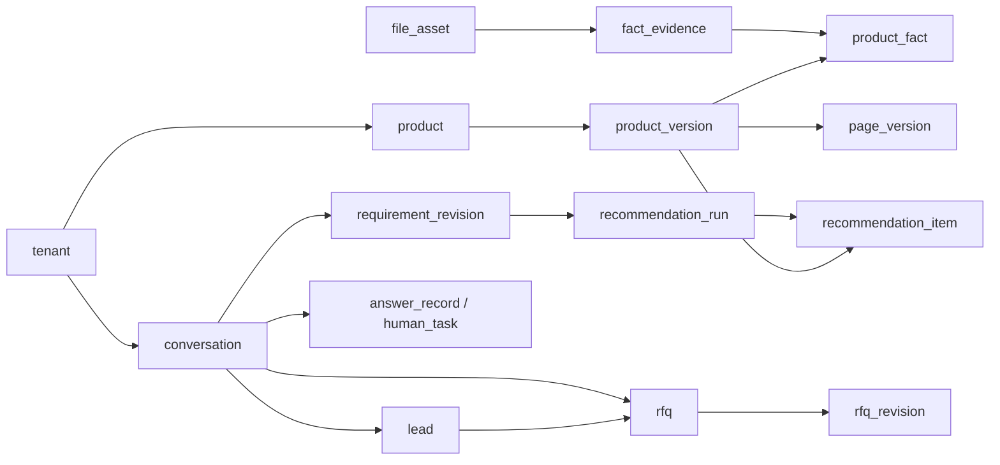

# MVP 数据模型草案｜业务关系与字段级数据库设计

**状态**：2026-10-02 字段级设计草案，供开发前评审；表名、类型与约束是建议，不是已实施的 SQL。与 [MVP 开发需求文档](MVP-开发需求文档.md)、[技术架构草案](技术架构草案.md)第 3、4 节及[完整客户旅程](完整客户旅程与界面验收.md)配套使用。

## 1. 现在决定到什么程度

现在先提出一版能覆盖已知 MVP 旅程的表和字段，再在开发每个功能切片时核对字段、约束、索引与迁移脚本。试点反馈可以改变字段和表的组织方式，但不能让已发送的推荐、答复和 RFQ 失去当时依据。无需等界面雏形做好后才首次设计数据库，也无需现在冻结物理表结构。

| 时点 | 要完成的事 | 暂不固定的事 |
| --- | --- | --- |
| 功能开发前 | 核对下文核心对象、建议字段、企业隔离、产品事实来源、版本及快照关系 | 最终 SQL、全部索引及未决定的业务规则 |
| 逐条用户旅程开发时 | 按对应表建立最小结构、约束和版本化迁移；用样例数据走通读写 | 未来营销、CRM、支付等功能的数据表 |
| 小范围试点后 | 根据真实缺字段、查询和数据质量问题做迁移；保留历史映射 | 无依据地一次性重建全库 |

## 2. MVP 最小逻辑对象

这里的“对象”不等于“一对象一张表”；开发时可合并或拆分，但关系必须可追踪。

| 对象 | 关键关系与必须保留的信息 |
| --- | --- |
| 企业、成员 | 企业是后台数据的归属边界；成员操作记录企业、操作者和时间。公开页的访问权限另行控制。 |
| 产品/型号、来源资料 | 型号属于企业；原手册、CAD 和其他附件记录来源、文件版本、权限及所属型号。新上传不覆盖旧文件。 |
| 核准产品事实/产品版本 | 技术字段保留数值、单位、出处及核准状态；缺失字段显式标记，不为有限信息页面编造值。发布后形成可引用的产品版本；补齐或更正再形成新版本。提取草稿与核准事实分开。 |
| 产品详情页版本 | 页面引用某个已核准产品版本；授权成员核对现有内容及缺项后可发布有限信息页，不要求先收齐曲线、CAD 或全部参数。页面记录核准/发布者、版本、状态和时间；补齐后重新发布，旧版可追查。页面排版不成为第二套技术参数。 |
| 会话、消息、需求修订 | 消息保留原文和来源；需求区分 AI 提取候选、买方/销售确认值、买方确认的未知项；每次更正形成可追踪修订。网页对话、详情页上下文、人工答复状态与 RFQ 关联同一会话，跨页不因路由变化重建对象；匿名买方仅凭同一浏览器中仍有效的会话访问凭据接续，清除站点数据或换设备不自动关联旧会话，服务端记录仍保留给有权限的卖方。匹配候选对外展示前，能追到买方确认已知值和未知标记的动作；V1 外部渠道保留原渠道的确认/更正消息。 |
| 推荐 | 记录当时已确认的需求修订、候选产品版本、匹配规则/依据、冲突和未知项；匹配资格由已核准事实及规则决定，不等同页面发布状态。区分“可初步推荐”与“待核实候选”，后者须有已核准的相关性依据、无已知硬冲突并由买方选择查看；缺乏相关性依据的公开页不生成匹配候选。保留买方所见标签和理由；发给买方后仍能复现理由，已知型号公开页访问不伪造一条匹配推荐。 |
| 问答、引用、人工任务 | 回答关联会话、所用产品版本及具体出处；资料不足或需判断时先记录未解问题，买方提交人工请求后才创建需对外回复的任务。任务记录买方选定的回复路径；仅在原网页对话查看不要求邮箱或电话。等待时买方可继续提其他问题；工程师追问及买方补充关联原任务和原会话，状态区分待工程师与待买方，不为同一追问另建任务。人工答复区分已写草稿、已发布到会话以及通过已有联系方式人工回复的记录；工程师的单次答复不自动变成通用产品事实。 |
| RFQ、线索、跟进 | 买方可在任意阶段提交 RFQ；保存初次提交时已有的需求和推荐快照（若尚无则记为空及原因）、买方确认的可回复联系方式及其来源、缺失项。买方对同一 RFQ 字段的增补、移除或修改形成连续修订；当前内容供原买方查看，初次提交与逐次变更仅供卖方授权人员查看。不提供买方撤回整份 RFQ 的操作；RFQ 记录存在、线索当前采购阶段与“停止主动联系”标记分别记录。买方明确要求停止主动联系时保留原话、来源和时间，暂停主动跟进；再次主动联系可回应并记录状态变化。报价资料完整性与 RFQ 提交状态分开。新 RFQ 进入企业共享队列；线索关联可为空的负责人、处理状态与跟进记录，买方修订在原线索产生卖方可见的变更提醒；领取、分配、改派记录操作者和时间。已有渠道身份不能未经核对就当成可用的回复方式。 |

一条关键追踪链是：`企业 → 产品版本 ← 来源资料`；`会话 → 需求修订 → 推荐 → 产品版本/详情页版本 → 问答或人工任务 → RFQ/线索`。同一客户可有多次需求修订，产品也可有多个版本，因此不应只保存“当前值”。

## 3. 比表名更早要定的规则

1. **企业隔离**：企业私有对象和查询都有可信的企业归属；不能仅依靠前端传入的 `tenantId` 限制访问。买方公开链接与企业后台权限分开。
2. **出处与核准**：参数值要能追到来源资料与核准记录；AI 抽取结果不能直接作为已核准产品事实。
3. **版本与快照**：产品更新后，旧页面、推荐、回答和 RFQ 仍可追到当时使用的版本；更正以新修订表示。买方修改 RFQ 只改变当前内容，不能覆盖初次提交及后续变更；卖方查看历史，买方只看当前内容。需求更正后旧候选失效，新候选关联新的买方确认修订；确认未知不等于确认产品适用。
4. **单位与可匹配字段**：流量、扬程、功率等选型关键量应有明确类型和单位，不能全部藏在自由文本中。不同产品类别的扩展参数可逐步定义，不必现在把所有工业品参数做成固定列。
5. **幂等与操作历史**：外部消息或 RFQ 重试提交应有去重依据；发布、核准、转人工及处理状态变化保留操作者和时间。
6. **地域含义分开**：`tenantId` 是企业归属；卖方市场、买方语言/地区和数据部署地域各自表达不同问题。海外版本的数据物理隔离方案须在海外公开测试前单独确定。

## 4. 现在不预建的部分

暂不为 SEO 批量内容、营销序列、CRM 双向同步、支付或自动 CAD 建模设计完整物理表。仅保留现有对象的稳定 ID、版本、来源和必要状态，供未来扩展。也不先把所有字段塞进单个 JSON 文档：那会使筛选、单位校验、来源追溯和版本比较变得困难。

## 5. 开发与验收检查

- 每个功能切片提交数据库迁移脚本；用已有试点样例验证迁移后历史记录仍可读。
- 用两个企业的数据验证私有产品资料、会话、RFQ、文件及检索结果不能串读。
- 更新产品资料后，能展示旧 RFQ 当时引用的参数和来源；不会静默变成最新版。
- 同一询盘或 RFQ 重试不会生成重复业务记录；缺证据的问答能关联到人工任务。
- 首次使用真实试点数据前，完成数据库和关键文件的备份恢复演练；要求见 [架构决策记录](架构决策记录.md)。

## 6. 字段级设计的口径与术语

下文用 `uuid`、`text`、`numeric`、`timestamptz` 等 **PostgreSQL 候选类型**说明意图；实际长度、枚举、迁移顺序和数据库约束在对应功能切片落实。`?` 表示字段允许为空，但业务动作可能另有必填条件。除 `tenants`、全局 `users` 等明确说明的例外，所有企业私有表均有 `id uuid` 主键、`tenant_id uuid`、`created_at timestamptz`；可编辑的当前状态表另有 `updated_at timestamptz`。下表不再逐行重复这三个共用字段。`tenant_id` 必须由可信服务端上下文获得，不能信任买方请求中的企业 ID。历史版本/修订原则上只追加，不原地改写。

| 术语 | 本项目中的含义，避免混用 |
| --- | --- |
| 企业 `tenant` | 卖方组织和私有数据的归属边界；不是买方国家或数据库部署地域。 |
| 产品 `product` / 产品版本 `product_version` | 一个型号的稳定身份 / 某次已核准技术事实的不可变快照。 |
| 页面 `product_page` / 页面版本 `page_version` | 可分享的稳定公开链接 / 某次审核发布的呈现内容；页面不拥有第二套技术真值。 |
| 需求修订 `requirement_revision` | 同一会话里买方已知值、待确认值和明确未知项在某一时点的记录。只有确认过的修订可向买方展示匹配候选。 |
| 推荐 `recommendation_run` | 针对一个需求修订、规则版本和产品版本集合的结果快照；不是最终工程选型。 |
| RFQ / 线索 `lead` | 买方的一份询价请求 / 卖方持续处理的销售上下文；RFQ 是否存在与采购阶段、停止主动联系状态分别记录。 |
| 联系方式 / 身份凭据 | 联系方式用于回复 RFQ；匿名网页会话访问凭据用于读取原会话。输入相同邮箱不等于通过身份核验。 |

核心可追溯关系建议如下；虚线含义改以文字说明，避免把可选步骤画成必经步骤。

页面直接入口、资料问答和 RFQ 可以先于需求确认与推荐发生；因此这些关联字段有些允许为空。所有对象都须能沿 `tenant_id` 返回所属企业。

## 7. MVP 建议表与字段

下表按完整 MVP 旅程列出**关系设计候选**，目的是让两位开发者先约定数据边界。它不是要求开工时一次建齐所有物理表：每个切片只落地必要关系；若几个简单关系可安全合并，可在迁移评审时合并，但须保留来源、权限和历史约束。

### 7.1 企业、登录和权限（所有模块共用）

| 表 | 关键字段（不重复第 6 节共用字段） | 用途与关系 |
| --- | --- | --- |
| `tenants` | `id uuid PK`，`name text`，`seller_market text`，`default_locale text`，`status text`，`created_at timestamptz` | 卖方企业。`seller_market` 与买方语言、数据部署地域不同；MVP 先服务国内卖方。 |
| `users` | `id uuid PK`，`auth_subject_id text UNIQUE`，`login_email text?`，`status text`，`created_at timestamptz` | 后台登录主体；身份服务选择未定，不在此保存密码明文。 |
| `tenant_members` | `user_id uuid FK`，`role text`，`status text`，`invited_by_member_id uuid?`，`joined_at timestamptz?` | 用户属于哪个企业，兼任多企业时仍分别鉴权。`role` 至少区分管理员、产品核准/发布、工程师、销售的权限组合；最终角色名可调整。 |
| `member_permissions` | `member_id uuid FK`，`permission_key text`，`allowed boolean`，`changed_by_member_id uuid` | 管理员对成员的功能授权覆盖项。登录、核准、发布、查看联系信息和分配任务在服务端按权限核验；具体权限清单随 UI 开发核准。 |

### 7.2 产品知识、来源与页面（M1、M2）

| 表 | 关键字段 | 用途与关系 |
| --- | --- | --- |
| `products` | `model_code text`，`display_name text`，`category_code text`，`status text`，`current_product_version_id uuid?` | 型号稳定身份；建议 `UNIQUE(tenant_id, model_code)`。MVP 的预设水泵品类由企业核对，V1 再增加模型初判与真人品类核准流程。 |
| `file_assets` | `product_id uuid`，`storage_key text`，`sha256 text`，`original_filename text`，`mime_type text`，`file_kind text`，`origin_kind text`，`usage_permission text`，`parent_asset_id uuid?`，`supersedes_asset_id uuid?`，`uploaded_by_member_id uuid?`，`processing_status text` | 原手册、表格、CAD、图片及从原件生成的预览文件。原文件须记录上传成员，后台生成的预览可为空；每次上传新行。`parent_asset_id` 仅表示衍生预览，不能将示意图冒充原厂 CAD。文件内容在对象存储，表内保存定位与许可。 |
| `fact_drafts` | `product_id uuid`，`field_key text`，`raw_value_text text?`，`value_kind text?`，`value_number numeric?`，`range_min numeric?`，`range_max numeric?`，`value_text text?`，`unit_code text?`，`source_asset_id uuid?`，`source_locator text?`，`extraction_method text`，`supersedes_draft_id uuid?`，`review_status text`，`reviewed_by_member_id uuid?`，`reviewed_at timestamptz?`，`review_note text?` | AI 抽取或人工补录的待核对字段；原文、规范化值及后续更正可追查。抽取失败时规范化类型和值可为空，不会自动形成已核准事实。字段名来自 MVP 预设水泵字段表；这不是公开知识表。 |
| `product_versions` | `product_id uuid`，`version_no integer`，`status text`，`approved_by_member_id uuid?`，`approved_at timestamptz?`，`withdrawn_at timestamptz?`，`supersedes_version_id uuid?`，`change_note text?` | 已核准事实的版本容器；批准后的事实内容不可原地覆盖。撤回影响新的推荐和回答，旧 RFQ 仍指向原版本。 |
| `product_facts` | `product_version_id uuid`，`field_key text`，`value_kind text`，`value_number numeric?`，`range_min numeric?`，`range_max numeric?`，`value_text text?`，`unit_code text?`，`visibility text`，`from_fact_draft_id uuid?`，`approved_by_member_id uuid`，`approved_at timestamptz` | 某版本已核准的流量、扬程、材质、介质条件等事实。数值/范围/文本按类型择一；匹配用的关键量和单位须能比较，不可只放进大段文字或任意 JSON。缺失字段不伪造事实行，可在页面缺项清单说明。 |
| `fact_evidence` | `product_fact_id uuid`，`file_asset_id uuid`，`locator_type text`，`locator_value text`，`evidence_note text?` | 一个事实可指向多个原文件位置，支持页码、表格单元格、图号或 CAD 位置等定位方式。问答引用可追到该出处。 |
| `product_pages` | `product_id uuid`，`locale text`，`public_slug text`，`current_page_version_id uuid?`，`status text` | 稳定的可分享页面链接；建议 `(tenant_id, product_id, locale)` 和 `(tenant_id, public_slug)` 唯一。公开路由必须能从域名或路径安全解析企业；页面链接本身不含买方工况或会话凭据。 |
| `page_versions` | `product_page_id uuid`，`product_version_id uuid`，`version_no integer`，`status text`，`approved_by_member_id uuid?`，`approved_at timestamptz?`，`published_by_member_id uuid?`，`published_at timestamptz?`，`withdrawn_at timestamptz?` | 页面草稿、预览、核准和发布历史。允许资料不全的版本发布，但已展示内容与缺项须人工审核；已发布版本不原地改写。 |
| `page_blocks` | `page_version_id uuid`，`block_kind text`，`sort_order integer`，`product_fact_id uuid?`，`file_asset_id uuid?`，`reviewed_copy text?`，`visibility text` | 选择当前页面展示的事实、素材及经过审核的说明文案；事实数值仍读取 `product_facts`。具体首屏和区块顺序尚待调研，这里的顺序字段仅支持预设模板生成与页面预览，不代表 UI 方案已定。 |

`fact_drafts` 的人工更正可以有多次，核准动作及核准前后的关键变化还须写入第 7.6 节的 `audit_events`。对于同一版本、同一 `field_key` 是否允许多条值（例如多种适用材质），应由该字段的品类定义决定；不能无条件设置全局唯一。

### 7.3 会话、匿名访问与需求（M3）

| 表 | 关键字段 | 用途与关系 |
| --- | --- | --- |
| `conversations` | `source_channel text`，`entry_page_version_id uuid?`，`buyer_locale text`，`status text`，`opened_at timestamptz` | 网页买方与企业的对话容器；从公开产品页直接进入也建立会话，后续问答、人工任务与 RFQ 复用该 ID。渠道来源和买方语言不当成企业归属。 |
| `conversation_access` | `conversation_id uuid`，`credential_hash text`，`expires_at timestamptz`，`revoked_at timestamptz?`，`last_used_at timestamptz?` | 匿名网页返回原会话的访问凭据，只存摘要，不存明文；同一浏览器且凭据有效时才可读私人记录。可为凭据轮换保留多条记录；凭据有效期、续期和失效后的提示文案待实现时确定。清除站点数据或换设备不自动合并会话。 |
| `messages` | `conversation_id uuid`，`human_task_id uuid?`，`sender_kind text`，`sender_member_id uuid?`，`body_text text`，`channel text`，`client_message_key text?`，`sent_at timestamptz` | 买方、Agent、销售或工程师的原消息；人工追问与答复仍挂原会话和原任务。重试可按 `(tenant_id, conversation_id, client_message_key)` 去重；内部销售备注不要冒充给买方发送的消息。 |
| `requirement_revisions` | `conversation_id uuid`，`revision_no integer`，`state text`，`source_message_id uuid?`，`supersedes_revision_id uuid?`，`confirmed_by_kind text?`，`confirmed_at timestamptz?` | 一次需求摘要的版本。AI 提取候选、买方更正和确认过程可产生新修订；向买方展示匹配候选须指向已确认修订。确认未知项不等于确认产品适用。 |
| `requirement_values` | `requirement_revision_id uuid`，`field_key text`，`value_state text`，`value_kind text?`，`value_number numeric?`，`range_min numeric?`，`range_max numeric?`，`value_text text?`，`unit_code text?`，`source_message_id uuid?` | 每个工况字段为“已确认、待确认、明确未知”等状态；数值、范围、单位与原话关联。未知项不存伪造数值；推荐只能将已确认值当已知条件。 |

### 7.4 匹配、推荐、问答与人工任务（M4、M5）

| 表 | 关键字段 | 用途与关系 |
| --- | --- | --- |
| `match_rule_versions` | `category_code text`，`version_no integer`，`status text`，`definition_json jsonb`，`approved_by_member_id uuid?`，`approved_at timestamptz?` | 经企业工程负责人核准的规则快照；`definition_json` 仅保存可校验的规则配置，规则引用的技术事实仍在 `product_facts`。具体水泵阈值未由用户或企业提供，不能在数据库设计中编造。 |
| `recommendation_runs` | `conversation_id uuid`，`requirement_revision_id uuid`，`match_rule_version_id uuid`，`result_state text`，`reason_code text?`，`reason_text text?`，`buyer_choice text?`，`presented_at timestamptz?`，`invalidated_at timestamptz?` | 一次计算的整体结果：初步候选、条件不足或无可靠候选；无可靠候选时也保存可解释原因。候选真正对买方展示时保存 `presented_at`；需求更正后旧结果标失效，历史仍在。直接打开已知型号公开页不生成虚构推荐。 |
| `recommendation_items` | `recommendation_run_id uuid`，`product_version_id uuid`，`page_version_id uuid?`，`label text`，`reason_text text`，`missing_summary text?`，`buyer_visible_at timestamptz?`，`buyer_selected_at timestamptz?` | 单个候选及买方实际看到的“可初步推荐/待核实”标签。待核实候选仅在买方明确选择后显示；硬冲突和无技术相关性依据的产品不能写入可见候选。 |
| `recommendation_evidence` | `recommendation_run_id uuid`，`product_version_id uuid`，`recommendation_item_id uuid?`，`requirement_value_id uuid?`，`product_fact_id uuid?`，`outcome text`，`explanation text?` | 对每个被评估型号保留满足、硬冲突、未知、相关性或排除依据；`recommendation_item_id` 仅在成为可见候选时有值。无可靠候选也能追查为什么排除某型号；事实来源版本须与被评估产品版本一致。 |
| `answer_records` | `conversation_id uuid`，`question_message_id uuid`，`answer_message_id uuid?`，`product_version_id uuid?`，`answer_state text`，`unresolved_reason text?`，`ai_invocation_id uuid?` | 一次提问及其有据答案，或未解问题。直接网页进入也可有问答；资料不足时不生成虚假结论，买方未请求前不自动生成对外人工任务。 |
| `answer_citations` | `answer_record_id uuid`，`product_fact_id uuid?`，`file_asset_id uuid`，`locator_type text`，`locator_value text`，`quoted_scope text?` | 技术主张定位到当时可用的资料、页码/位置与产品版本；引用不随新文件上传静默改变。 |
| `human_tasks` | `conversation_id uuid`，`question_message_id uuid?`，`requirement_revision_id uuid?`，`recommendation_run_id uuid?`，`response_path text`，`status text`，`assignee_member_id uuid?`，`requested_at timestamptz`，`answered_at timestamptz?`，`external_reply_channel text?`，`external_reply_recorded_at timestamptz?`，`external_reply_result text?` | 买方提交人工请求后才创建。状态须能区分待工程师、待买方补充、已答复；工程师追问和买方补充保存在同一任务关联的 `messages`。原网页发布与已有渠道人工回复的结果分别记录，不把草稿算作已送达。 |
| `human_task_contacts` | `human_task_id uuid`，`contact_kind text`，`contact_value_ciphertext text`，`display_mask text`，`source_channel text`，`buyer_confirmed_at timestamptz` | 买方自愿选择用已有联系方式接收人工回复时保存该任务可用的联系点；只在原网页查看的请求可以没有此行。它不自动生成 RFQ 联系方式，也不证明跨设备访问原会话的身份。 |

### 7.5 RFQ、销售与跟进（M6、M7）

| 表 | 关键字段 | 用途与关系 |
| --- | --- | --- |
| `leads` | `conversation_id uuid?`，`stage text`，`owner_member_id uuid?`，`stop_proactive_contact_at timestamptz?`，`stop_source_message_id uuid?`，`stop_recorded_by_member_id uuid?`，`quote_readiness text?` | 卖方工作台上下文。一个网页会话在 MVP 中建议对应一个线索，线索可早于 RFQ；采购阶段、报价准备度及停止主动联系是不同字段。来源企业/负责人变化写操作历史。 |
| `rfqs` | `conversation_id uuid`，`lead_id uuid`，`initial_requirement_revision_id uuid?`，`initial_recommendation_run_id uuid?`，`current_revision_id uuid?`，`status text`，`submitted_at timestamptz`，`submit_idempotency_key text` | 一份买方询价的稳定身份。需求、推荐可为空；提交时不因缺工况、型号或数量拒收。提交与初次修订、线索入队应在同一事务完成。重复提交键在企业范围内唯一。 |
| `rfq_revisions` | `rfq_id uuid`，`revision_no integer`，`revision_kind text`，`requirement_revision_id uuid?`，`recommendation_run_id uuid?`，`quantity numeric?`，`quantity_unit text?`，`destination_text text?`，`desired_date date?`，`buyer_note text?`，`changed_by_kind text`，`changed_at timestamptz` | 买方提交及每次增补、移除、修改的不可变快照。买方界面只读当前修订；卖方可比较初次与历次变化。联系信息单列在下表，避免所有卖方查看 RFQ 历史的人都能读明文联系信息。 |
| `rfq_revision_products` | `rfq_revision_id uuid`，`product_version_id uuid`，`page_version_id uuid?`，`selection_source text` | 记录买方当时指定或推荐带入的型号版本；允许零行表示尚未选型。一个 RFQ 是否允许买方主动询多款仍待产品决定，这张关系表不意味着 UI 已支持多款下单。 |
| `rfq_revision_contacts` | `rfq_revision_id uuid`，`contact_kind text`，`contact_value_ciphertext text`，`display_mask text`，`source_channel text`，`buyer_confirmed_at timestamptz` | 提交时至少一条经买方确认、销售能实际回复的联系方法；已接入渠道的值也须核对。仅授权成员可解密。后续买方要求清空全部联系方式如何处理仍待决定，不从“可编辑 RFQ”推断可无条件清空。 |
| `followups` | `lead_id uuid`，`owner_member_id uuid`，`due_at timestamptz`，`status text`，`note text?`，`completed_at timestamptz?` | 销售下一步与到期提醒；停止主动联系后不得继续安排主动触达，已有待办需要相应更新。MVP 不自动向买方发营销消息。 |

`rfq_revisions` 表示每次保存后的**完整当前内容**，而非只记录变化的字段；当联系方式或选定型号未改变时，当前修订也须能关联到仍有效的对应记录。初次与逐次差异由完整修订比较产生，买方不需要看到内部历史。

### 7.6 支撑追踪、模型调用和处理任务（跨模块）

| 表 | 关键字段 | 用途与关系 |
| --- | --- | --- |
| `audit_events` | `entity_type text`，`entity_id uuid`，`event_type text`，`actor_kind text`，`actor_member_id uuid?`，`actor_conversation_id uuid?`，`before_summary jsonb?`，`after_summary jsonb?`，`occurred_at timestamptz` | 核准、发布/撤回、任务转交、RFQ 提交/修订、线索分配、阶段/停联状态变化等关键动作的追加历史；摘要避免重复存完整联系方式。RFQ 全量历史由 `rfq_revisions` 保证，审计事件不能代替它。 |
| `ai_invocations` | `task_kind text`，`provider_key text`，`model_key text`，`prompt_version text?`，`status text`，`error_code text?`，`input_tokens integer?`，`output_tokens integer?`，`estimated_cost numeric?`，`cost_currency text?`，`related_entity_type text?`，`related_entity_id uuid?`，`started_at timestamptz`，`finished_at timestamptz?` | AI 调用边界的任务、模型版本、失败和成本记录；默认不保存完整买方消息或机密资料副本，技术排错所需内容另按访问权限和保存期限决定。此表不代表已决定双模型供应商。 |
| `processing_jobs` | `job_kind text`，`related_entity_type text`，`related_entity_id uuid`，`status text`，`attempt_count integer`，`error_code text?`，`started_at timestamptz?`，`finished_at timestamptz?` | 文件抽取、预览生成、检索索引更新等耗时处理；失败可在后台呈现并重试，不能让失败草稿误变成核准事实。 |
| `interaction_events` | `conversation_id uuid?`，`page_version_id uuid?`，`event_type text`，`occurred_at timestamptz`，`event_context jsonb?` | 最小旅程事件：入口、摘要确认、候选展示、页面/CAD 查看、人工请求/答复查看、RFQ 提交/修订与跟进完成。只记录实际发生的事件，演示数据需可识别；事件不等于成交或因果归因。 |

这些是**逻辑表候选**，并非要求在检查点 0 一次创建全部表。每个切片只迁移本切片所需表；跨模块 ID 和版本关系先由两名开发者共同审核。`ai_invocations`、`processing_jobs`、`interaction_events` 的具体字段可随试点观测需要缩减，但保留任务状态、失败与来源可追踪的要求。

## 8. 关系、约束与读写边界

1. **跨企业外键**：私有子表既含 `tenant_id`，也引用父表 ID。实际 SQL 应用复合外键或等价的服务端校验保证父子属于同一企业；只在 UI 隐藏按钮不算隔离。买方对话、RFQ 与文件权限同理。
2. **版本唯一与不可变**：建议 `(tenant_id, product_id, version_no)`、`(tenant_id, product_page_id, version_no)`、`(tenant_id, conversation_id, revision_no)`、`(tenant_id, rfq_id, revision_no)` 唯一。批准后的产品事实、发布后的页面、已展示的推荐和已提交的 RFQ 修订只追加新版本或状态事件，不覆盖历史内容。
3. **公开发布关口**：`product_pages.current_page_version_id` 只能指向同企业、已核准且已发布的 `page_versions`；页面所指产品版本必须已核准，`page_blocks.product_fact_id` 只能引用该产品版本内的事实，素材须有对应公开使用许可。发布有限信息页允许缺字段，但每个公开主张有核准事实或审过的非技术文案。事实撤回后的新回答与新推荐停用相关内容，旧 RFQ 保留当时依据。
4. **候选展示关口**：`recommendation_runs.presented_at` 和 `recommendation_items.buyer_visible_at` 只在 `requirement_revisions.confirmed_at` 已存在时写入；待核实项还需买方选择记录和核准的相关性证据。直接访问已知产品页不生成推荐。这个跨表规则需要事务与业务层验证，单靠 `NOT NULL` 不够。
5. **联系与匿名凭据**：RFQ 初次提交事务至少写入一条已确认的 `rfq_revision_contacts`；网页人工请求只有选择已有联系方式回复时才写入 `human_task_contacts`，原会话查看路径无须留资。匿名会话凭据只存摘要并保持唯一，访问私人消息和 RFQ 时验证有效性。公开产品 URL 与会话访问凭据分离；相同邮箱或号码不能自动链接旧会话。凭据具体寿命和个人数据保存期限尚未确定。
6. **幂等与一致性**：`rfqs.submit_idempotency_key` 在企业范围内唯一；消息有可选客户端去重键。RFQ、初次修订、联系确认及线索入队同事务提交；任务请求重复点击不得创建重复人工任务。建议按业务动作再定义任务请求去重键，不以“相同问题文本”错误合并不同请求。
7. **按业务查询建索引**：首批候选索引包括产品 `(tenant_id, model_code)`，已发布页 `(tenant_id, public_slug)`，消息 `(tenant_id, conversation_id, sent_at)`，人工任务 `(tenant_id, status, assignee_member_id)`，RFQ `(tenant_id, submitted_at)`，线索 `(tenant_id, owner_member_id, stage)`，跟进 `(tenant_id, owner_member_id, due_at)`。索引实际数量与顺序应依据查询和执行计划调整。
8. **文件与数值**：对象存储的 `storage_key` 不直接作为公开下载 URL；下载先验证企业/公开许可，再产生受控访问。流量、扬程等数值保留明确单位和比较规则；`definition_json`、`event_context` 等只用于规则配置或次要上下文，不能把技术事实、RFQ 当前值和联系权限藏在不受约束的 JSON 中。

## 9. 以真实旅程检查模型

| 场景 | 应生成或保持的记录 | 不能发生 |
| --- | --- | --- |
| 卖方上传第二版手册、补齐曲线后重发产品页 | 新 `file_asset`、事实草稿、核准后的 `product_version`、新 `page_version`；旧 RFQ 仍引用旧产品版本 | 覆盖原文件或让旧 RFQ 显示未经说明的新参数 |
| 买方已知型号直接打开页面并询价 | `conversation`、消息和 `rfq`；需求修订及推荐可为空，提交时有确认的联系方式 | 伪造一条“系统推荐适用”的记录，或因没选型拒收 RFQ |
| 买方需求不完整，先确认未知项后查看待核实候选 | 已确认 `requirement_revision`、标明缺项的 `recommendation_item`、核准事实依据和买方选择时间 | 未确认需求前展示候选，或把未知条件记录为满足 |
| 资料外问题请求工程师、工程师追问、买方补充 | 未解 `answer_record`、买方提交后建立的 `human_task`、同任务多条消息及状态历史 | 只打开请求面板就建任务，或工程师单次答复自动成为通用事实 |
| 买方提交 RFQ 后修改数量，随后要求停止主动联系 | 同一 `rfq` 的两条修订、原线索的变更提醒和停止标记、相应跟进暂停 | 新建第二份 RFQ、覆盖初次内容或继续自动安排主动触达 |
| 匿名买方清除站点数据后再次访问同一产品 URL | 可打开公开页；原会话/RFQ 仍在卖方授权后台，但买方没有有效凭据不能读取 | 用公开 URL、可猜测 ID 或重新填同一邮箱直接找回私人对话 |

## 10. 当前不作数据库决定的事项与 V1 接口

- **RFQ 编辑边界**：买方后来要求清空最后一种联系方法时怎样处理、一个 RFQ 是否允许主动选择多款产品，均未由用户定案。`rfq_revision_products` 支持历史关联，不预设买方 UI；初次提交至少一种确认联系方式的规则已确定。
- **匿名凭据与买方数据**：凭据有效期、续期、数据保留/删除规则、未来跨设备身份核验方式，需在开发或试点前单独确定。当前只确定同浏览器有效凭据边界及企业后台历史保留要求。
- **V1 扩展锚点**：正式渠道接入后再设计 `channel_connections`、外部消息 ID 映射与发送结果；企业 DIY 模板进入 V1 时再设计模板草稿/版本/审批/企业隔离表；CRM 同步、营销序列、批量 SEO、自动 CAD 建模继续遵循[长期代办](长期功能代办备忘录.md)，不预建其物理表。
- **地域配置**：`tenants.seller_market`、`conversations.buyer_locale` 与实际部署的 `data_region` 不混为一列。`data_region` 先由部署配置和运维记录管理；海外版数据物理隔离与迁移在海外测试前另定。

**下一步**：两位开发者实现检查点 0 时，先核对字段命名、租户复合外键、成员权限与共享 ID；第一个实际迁移只覆盖 M1/M2 所需的最小表。后续按 M3–M7 逐步迁移并用第 9 节场景验收。本文件提供字段级设计起点，不宣称已有数据库或已经解决全部待定产品规则。
